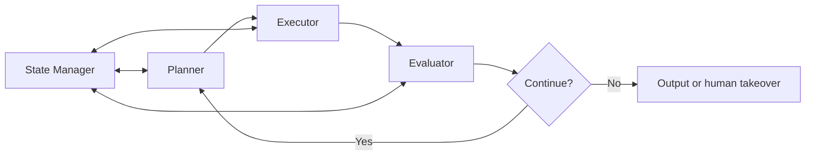

## 1. What is a Loop Engineering Harness?

This article uses Loop Engineering Harness to describe an engineering pattern, rather than a standardized term. It describes how an agent plans, executes, checks results, saves state, and decides whether to continue during a multi-step task.

<Callout tone="note" title="A note on terminology">
Different frameworks use runtime, agent loop, orchestrator, or harness for related but distinct concepts. This article discusses the control loop itself. It does not treat any one framework's terminology as an industry standard.
</Callout>

In this context, a harness has three main responsibilities:

- **Loop control**: deciding when to continue iterating and when to stop
- **State management**: maintaining context and memory across iterations
- **Feedback integration**: turning execution results into input for the next iteration

## 2. Design principles: why engineer the loop?

### 2.1 What complex tasks require

Real-world tasks rarely finish in a single reasoning pass. Consider code generation. An agent needs to understand requirements, write code, run tests, fix errors, and optimize performance. Each step can produce new information that changes later decisions.

```
Traditional linear process: input → processing → output, with no feedback
Harness loop: input → planning → execution → evaluation → feedback → replanning → ...
```

### 2.2 Core design principles

| Principle | Description |
| --------- | ----------- |
| **Bounded iteration** | Set a maximum iteration count to prevent infinite loops |
| **Traceable state** | Serialize each iteration's state to support checkpoint recovery |
| **Feedback-driven decisions** | Let execution results directly inform the next decision |
| **Observability** | Make the loop visible to developers for debugging |

### 2.3 Designing stopping conditions

A harness must explicitly define when to exit the loop. Common strategies include:

- **Goal achieved**: task metrics meet predefined thresholds
- **Budget exhausted**: the maximum iteration count or token limit is reached
- **Convergence detected**: output shows no significant change across several consecutive iterations
- **Human intervention**: an external signal forces the loop to stop

## 3. Core components

### 3.1 Component overview



### 3.2 Each component in detail

**Planner**: generates the next action plan from the current state and goal. It receives feedback from the Evaluator and adjusts its strategy. In practice, the Planner is usually an LLM call whose prompt includes prior context and the previous iteration's evaluation.

**Executor**: turns the Planner's plan into concrete actions, such as calling tools, executing code, querying databases, or generating content. The Executor lets the agent interact with the outside world.

**Evaluator**: assesses the quality of execution results, checks whether subgoals have been met, and identifies errors and deviations. Evaluation can be rule-based, such as the test pass rate, or model-driven, such as LLM-as-Judge.

**State Manager**: maintains the state of the entire loop, including task progress, action history, intermediate results, and the context window. It makes stateful iteration possible.

**Termination Judge**: decides whether to exit the loop based on predefined rules and the current state.

## 4. The role of the loop in AI agent architecture

### 4.1 From tool calls to autonomous iteration

Early function-calling patterns were single-turn. The model chose a tool, received its result, and produced an output. A harness extends this to **autonomous iteration across multiple turns**, so an agent can try, fail, and retry.

### 4.2 Engineering benefits

| Dimension | Without a harness | With a harness |
| --------- | ----------------- | -------------- |
| Reliability | Stops after a single failure | Automatic retries and corrections |
| Debuggability | Black-box output | Traceable state at every iteration |
| Control | No way to intervene | Defined points for human intervention |
| Extensibility | Hard-coded workflow | Replaceable modular components |

### 4.3 Typical use cases

- **Automated test repair**: the agent writes tests → runs them → analyzes failures → fixes the code → reruns the tests
- **Data analysis pipelines**: explore the data → detect anomalies → clean the data → analyze it again
- **Document generation**: draft → review → revise → finalize

## 5. A minimal implementation

The following simplified Loop Engineering Harness implementation shows the core loop logic:

```typescript
interface AgentState {
	goal: string;
	history: Array<{ action: string; result: string }>;
	iteration: number;
	maxIterations: number;
}

interface HarnessResult {
	success: boolean;
	finalState: AgentState;
	output: string;
}

class LoopEngineeringHarness {
	constructor(
		private planner: Planner,
		private executor: Executor,
		private evaluator: Evaluator,
		private stateManager: StateManager
	) {}

	async run(initialState: AgentState): Promise<HarnessResult> {
		let state = this.stateManager.initialize(initialState);

		while (state.iteration < state.maxIterations) {
			// 1. Plan the next step
			const plan = await this.planner.plan(state);

			// 2. Execute the plan
			const result = await this.executor.execute(plan);

			// 3. Evaluate the result
			const evaluation = await this.evaluator.evaluate(result, state.goal);

			// 4. Update the state
			state = this.stateManager.update(state, {
				action: plan.action,
				result: result.output,
				evaluation
			});

			// 5. Check whether to stop
			if (evaluation.goalAchieved || evaluation.shouldTerminate) {
				return {
					success: evaluation.goalAchieved,
					finalState: state,
					output: result.output
				};
			}

			state.iteration++;
		}

		return { success: false, finalState: state, output: 'Maximum iteration count reached' };
	}
}
```

## 6. What to check in an implementation

A loop does not automatically make a system reliable. At a minimum, an implementation should answer four questions. What changed in each iteration? Where are validation results saved? When does the budget or iteration limit run out? Who takes over after a failure?

If this state exists only in the model's current context, it becomes hard to recover after context compaction, a restart, or a session change. A more reliable approach is to store task state, tool results, and acceptance evidence outside the model context, then let the next iteration read what it needs.

A harness is useful when every iteration has clear inputs, actions, evidence, and exit conditions. Simply making an agent run more iterations does not provide that.
