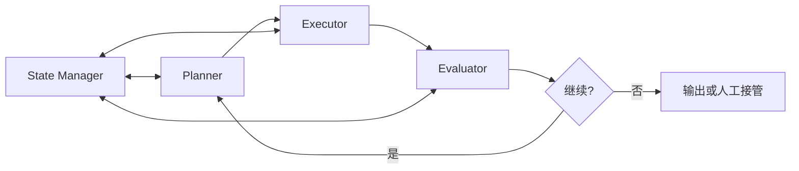

## 一、概念定义：什么是 Loop Engineering Harness

这里把 Loop Engineering Harness 当作一种工程模式，而不是一个统一标准名词。它描述的是 Agent 在多轮任务中如何计划、执行、检查结果、保存状态并决定是否继续。

<Callout tone="note" title="术语边界">
不同框架会用 runtime、agent loop、orchestrator 或 harness 表示相近但不完全相同的概念。本文讨论的是控制循环本身，不把某个具体框架的命名当成行业标准。
</Callout>

在这个语境下，Harness 主要承担三个职责：

- **循环控制**：决定何时继续迭代、何时终止
- **状态管理**：维护跨轮次的上下文和记忆
- **反馈整合**：将执行结果转化为下一轮迭代的输入

## 二、设计原理：为什么需要循环工程

### 2.1 复杂任务的本质需求

现实世界的任务很少能在单次推理中完成。以代码生成为例：Agent 需要理解需求、编写代码、运行测试、修复错误、优化性能——每一步都可能产生新的信息，改变后续决策。

```
传统线性流程：输入 → 处理 → 输出（无反馈）
Harness 循环：输入 → 计划 → 执行 → 评估 → 反馈 → 再计划 → ...
```

### 2.2 核心设计原则

| 原则           | 说明                           |
| -------------- | ------------------------------ |
| **有界迭代**   | 设置最大循环次数，防止无限循环 |
| **状态可追溯** | 每轮状态可序列化，支持断点恢复 |
| **反馈驱动**   | 执行结果直接影响下一轮决策     |
| **可观测性**   | 循环过程对开发者透明，便于调试 |

### 2.3 终止条件设计

Harness 必须明确定义循环退出的条件，常见策略包括：

- **目标达成**：任务指标满足预设阈值
- **预算耗尽**：达到最大迭代次数或 token 上限
- **收敛检测**：连续多轮输出无显著变化
- **人工干预**：外部信号强制终止

## 三、核心组件架构

### 3.1 组件总览



### 3.2 各组件详解

**Planner（规划器）**：根据当前状态和目标，生成下一步行动计划。它接收来自 Evaluator 的反馈，动态调整策略。在实现中，Planner 通常是一个 LLM 调用，prompt 包含历史上下文和上一轮评估结果。

**Executor（执行器）**：将 Planner 产出的计划转化为具体动作——调用工具、执行代码、查询数据库或生成内容。Executor 是 Agent 与外部世界交互的桥梁。

**Evaluator（评估器）**：对执行结果进行质量评估，判断是否达成子目标，识别错误和偏差。评估可以是规则化的（如测试用例通过率）或模型驱动的（如 LLM-as-Judge）。

**State Manager（状态管理器）**：维护整个循环的状态——包括任务进度、历史动作、中间结果和上下文窗口。它是实现"有状态迭代"的关键。

**Termination Judge（终止判断器）**：基于预设规则和当前状态，判断是否应该退出循环。

## 四、在 AI Agent 架构中的关键作用

### 4.1 从"工具调用"到"自主迭代"

早期的 Function Calling 模式是单轮的：模型决定调用哪个工具，获取结果后输出。Harness 将其升级为**多轮自主迭代**，使 Agent 具备真正的"尝试-失败-重试"能力。

### 4.2 工程化价值

| 维度     | 无 Harness     | 有 Harness     |
| -------- | -------------- | -------------- |
| 可靠性   | 单次失败即终止 | 自动重试与修正 |
| 可调试性 | 黑盒输出       | 每轮状态可追溯 |
| 可控性   | 无法干预       | 支持人工介入点 |
| 可扩展性 | 硬编码流程     | 模块化组件替换 |

### 4.3 典型应用场景

- **自动化测试修复**：Agent 编写测试 → 运行 → 分析失败 → 修复代码 → 重跑
- **数据分析管道**：探索数据 → 发现异常 → 清洗 → 重新分析
- **文档生成**：起草 → 审查 → 修订 → 定稿

## 五、最小化实现示例

以下是一个简化的 Loop Engineering Harness 实现，展示核心循环逻辑：

```typescript
interface AgentState {
	goal: string;
	history: Array<{ action: string; result: string }>;
	iteration: number;
	maxIterations: number;
}

interface HarnessResult {
	success: boolean;
	finalState: AgentState;
	output: string;
}

class LoopEngineeringHarness {
	constructor(
		private planner: Planner,
		private executor: Executor,
		private evaluator: Evaluator,
		private stateManager: StateManager
	) {}

	async run(initialState: AgentState): Promise<HarnessResult> {
		let state = this.stateManager.initialize(initialState);

		while (state.iteration < state.maxIterations) {
			// 1. 规划下一步
			const plan = await this.planner.plan(state);

			// 2. 执行计划
			const result = await this.executor.execute(plan);

			// 3. 评估结果
			const evaluation = await this.evaluator.evaluate(result, state.goal);

			// 4. 更新状态
			state = this.stateManager.update(state, {
				action: plan.action,
				result: result.output,
				evaluation
			});

			// 5. 终止判断
			if (evaluation.goalAchieved || evaluation.shouldTerminate) {
				return {
					success: evaluation.goalAchieved,
					finalState: state,
					output: result.output
				};
			}

			state.iteration++;
		}

		return { success: false, finalState: state, output: '达到最大迭代次数' };
	}
}
```

## 六、落到工程里要检查什么

循环本身不会自动带来可靠性。实现时至少要能回答四个问题：每轮改变了什么，验证结果保存在哪里，预算或次数什么时候耗尽，失败后由谁接管。

如果这些状态只存在于模型当前上下文里，任务一旦压缩、重启或切换会话就很难恢复。更稳的做法是把任务状态、工具结果和验收证据写到模型上下文之外，再让下一轮按需读取。

Harness 的价值不是让 Agent 多循环几次，而是让每一轮都有明确输入、动作、证据和退出条件。