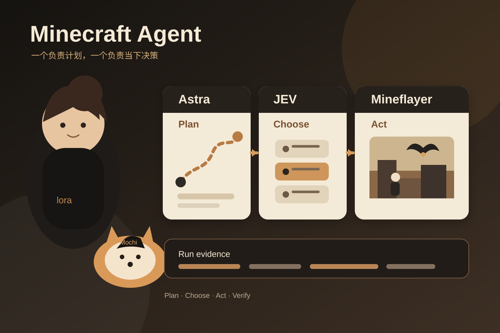

## 30 秒看懂

这个项目没有让一个大模型负责 Minecraft 里的每一个决定。

Astra 做更新频率较低的高层规划，决定当前目标和下一段路线。JEV 做高频决策，根据当前位置、库存、周围状态和当前目标，从有限动作集合里选择下一步。Mineflayer 再把移动、挖掘、拾取、合成和战斗真正执行到游戏里。

值得看的不是击败末影龙这个结果本身，而是同一个 Agent loop 可以按决策时间尺度拆成不同组件。

## 事实核验

项目仓库是 [rmalde/minecraft-agent](https://github.com/rmalde/minecraft-agent)。GitHub 显示仓库在 2026 年 9 月 20 日创建，当前公开且未归档。仓库没有 Release。

GitHub 账户是 `rmalde`。ASCII 在 2026 年 9 月 21 日的报道中将作者写为 Ronak Malde，并链接到他 2026 年 9 月 20 日的 [X 原帖](https://x.com/rronak_/status/2101544156757950697)。原帖包含运行视频，并说明代码已经公开。

核心机制来自仓库 README。GPT-6 Astra 或 GPT-5.6 Sol 负责设置当前目标、物品目标和路线点。JEV 根据结构化游戏状态选择下一步动作。Mineflayer 负责真正执行。这个项目不是让模型看截图以后逐键操作。

README 给出的最新验证运行是 `nether-final-08`。项目方记录它在 Minecraft Java 1.16.5 中从空库存开始，经过 Nether，最后用床爆炸击败末影龙并进入出口。记录时间为 8 分 43.300 秒。该运行调用 JEV 131 次，调用 Astra 35 次。仓库还写明 17 项运行检查、8 项路线、相机和画面检查，以及 29 项本地测试通过。

这些结果是项目仓库自报的运行记录，不是独立基准测试。

## 运行边界

这个结果不能脱离运行条件理解。

- 难度是 Peaceful。
- seed、路线和已知坐标提前选定。
- 最终路线写在配置文件里。
- Agent 使用结构化状态和 Mineflayer，不是视觉端到端控制。
- README 把完整生存运行和单独的 combat lab 测试分开描述。

当前公开的是源码。README 说明原生渲染和启动脚本主要在 macOS 开发。复现还需要兼容的 Minecraft Java 运行环境、Mineflayer 相关依赖和模型访问。Minecraft 二进制、世界存档、凭据和最终录制文件没有提交到仓库。

许可证也需要单独确认。GitHub 当前没有识别到仓库许可证。作者原帖使用了 `open sourced` 的说法，但在使用或再分发代码前，仍应先确认许可文件和授权范围。

## 为什么这套分层有用

很多 Agent 系统把规划、局部判断和工具执行都交给同一个模型。这样做实现简单，但高层目标和当前动作会共享同一种推理延迟，大模型也会反复处理本来可以被约束的问题。

这个项目把三类工作拆开。高层目标更新得慢，当前动作需要更低延迟，真正的路径移动和协议操作交给普通软件。README 还说明，Astra 更新规划时，JEV 可以继续按当前目标选择动作，游戏不需要因为规划模型思考而暂停。

这也让失败位置更容易区分。路线错了可以查 planner，当前动作选错了可以查 JEV，动作执行失败可以查 Mineflayer 和 Harness。

## 三个值得借鉴的设计

### 按决策频率拆组件

高层目标不需要每个 tick 更新，当前动作却需要低延迟。先按时间尺度拆任务，再决定用什么模型，比先选一个模型承担全部职责更容易控制延迟和故障范围。

### 限制动作集合

JEV 不是生成任意控制代码。它在 travel、mine、collect、craft、eat、sleep、combat 等有限动作里选择。动作空间越清楚，模型输出越容易检查，执行器也更稳定。

### 把验证写进 Harness

项目用 `events.jsonl` 保存请求、模型响应、动作和游戏结果，用 `status.json` 保存进度。`victory.json` 记录末影龙死亡和出口事件，仓库还提供 `verify-run.mjs`，并保留原生客户端录制流程。

最终结果因此可以回到动作日志和游戏事件核对，而不是只接受一句“Agent 成功了”。

## 证据卡

1. [项目 README](https://github.com/rmalde/minecraft-agent/blob/main/README.md) 用来核验模型分工、动作方式、运行条件、验证结果、复现步骤和限制。
2. [GitHub 仓库](https://github.com/rmalde/minecraft-agent) 用来核验仓库创建时间、公开状态、当前源码和许可证识别状态。
3. [Ronak Malde 的 X 原帖](https://x.com/rronak_/status/2101544156757950697) 是公开 Demo 来源，发布日期为 2026 年 9 月 20 日。
4. [ASCII 2026 年 9 月 21 日报道](https://ascii.jp/elem/000/004/436/4436545/) 用来交叉核验作者身份、原帖链接和运行条件。核心机制仍以仓库 README 为准。
