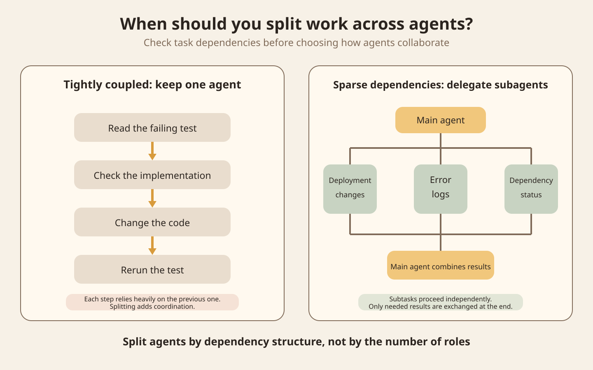
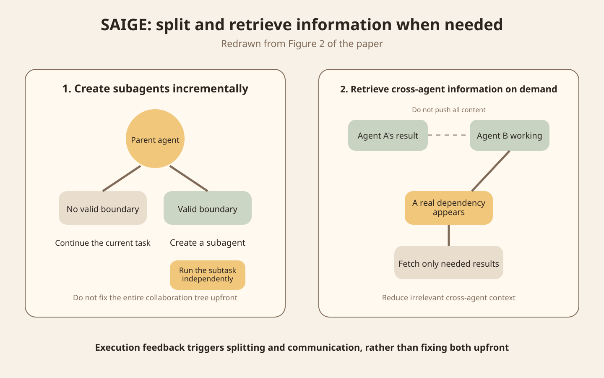
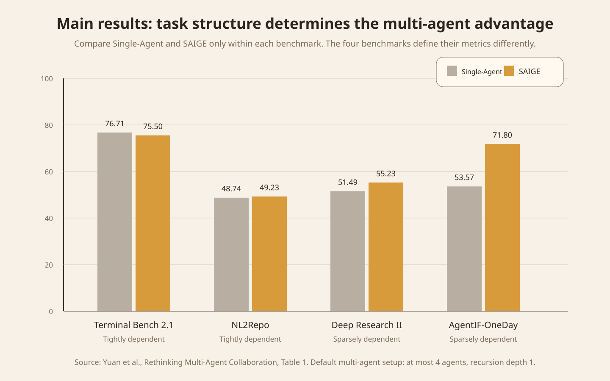
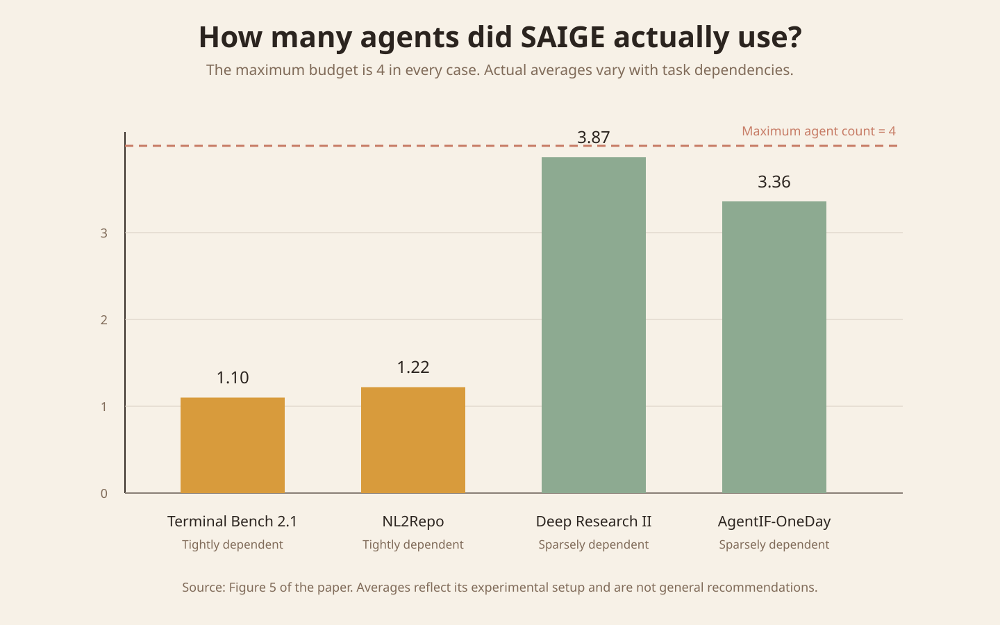

For a complex development task, when should one agent handle the work from start to finish, and when should you create several subagents to work in parallel?

The main source is the preprint [Rethinking Multi-Agent Collaboration: When More Is Less](https://arxiv.org/abs/2609.19759), first submitted on September 17, 2026, and updated to v2 on September 18. Its authors are from Nanjing University and Shanghai Jiao Tong University. For this article, I checked the methods, main experiments, ablations, and appendix case studies in the paper's PDF, and compared them with OpenAI's current [Agents API multi-agent documentation](https://developers.openai.com/zh-Hans/api/docs/guides/agents-api/multi-agent). I have not reproduced the experiments. All figures cited from the paper come from v2.

## Start with two development tasks

The first task is to fix a failing test. The agent reads the error, checks the implementation, changes the code, and reruns the test. Each step clearly depends on the previous one. Without reading the actual error, it is hard to make the right code change. Without seeing the result of that change, the agent cannot decide what to do next.

The second task is to investigate a sudden rise in a service's 5xx errors. Recent deployments, error logs, and the status of dependent services can be checked separately. The three investigations can proceed independently most of the time, with the main agent combining the evidence at the end.

Both tasks can be drawn as a set of roles, but their dependencies determine whether splitting the work across agents is worthwhile.

Figure 1 is an original teaching diagram for this article. The steps on the left form a long dependency chain. Splitting them means each agent must frequently wait for the previous result. The three investigations on the right can work independently and come together only at the end. The second structure is better suited to parallel delegation.

OpenAI's current multi-agent documentation gives similar engineering guidance. Independent tasks can go to subagents, while short tasks and interdependent steps stay with the main agent. If multiple agents edit the same files, they also need extra coordination.

## The paper maps dependencies as a graph

The paper treats a complete task as a sequence of execution steps. Each step contains the current observation and the agent's action. The authors then identify which earlier information each later step actually depends on and represent the execution trace as a directed acyclic graph.

One key concept is a bridge edge, a critical dependency edge connecting two relatively independent regions. Removing that edge divides the original dependency graph into two parts.

This maps directly to agent delegation. One agent can handle one side of the bridge, and another can handle the other. The two agents do not need to share their entire history. They only need to exchange the necessary information at the bridge.

Conversely, if the dependency graph has connections between regions everywhere, the task is tightly coupled. Forcing it into separate agents adds synchronization, waiting, and context transfer.

The paper's theoretical conclusion has explicit assumptions. It assumes that the complete trace is already known and that the split points are correct. Under these ideal conditions, splitting along a bridge edge does not increase context cost as defined in the paper. The paper also notes that this analysis does not account for mitigations such as context compression. Real systems face a harder problem because the orchestrator must predict where to split before the task is finished.

## SAIGE decides whether to split during execution

The paper introduces SAIGE, or Semantic-Aware Incremental Graph Evolution. It does not create a fixed number of agents at the start of a task.

The current agent begins executing. The system creates a subagent only when execution feedback reveals a dependency boundary that allows relatively independent work. If there is no suitable boundary, the parent agent continues rather than forcing a split.

The second design choice is on-demand message retrieval. A subagent saves its result when it finishes, but other agents do not receive all of that content upfront. They retrieve the relevant information only when a step actually depends on it.

Figure 2 is redrawn from Figure 2 of the paper. The left side shows when to create a subagent, and the right side shows when to read another agent's results. Execution feedback triggers both decisions.

## Multi-agent methods did not win on every task

The authors compare Single-Agent, TDAG, DynTaskMAS, GoA, and SAIGE on four long-horizon task benchmarks: Terminal Bench 2.1, NL2Repo, Deep Research Bench II, and AgentIF-OneDay. To reduce differences between harnesses, all methods use the Codex CLI harness with DeepSeek-V4-Pro as the base model. In the main experiments, the multi-agent methods use at most 4 agents with a recursion depth of 1.

The four benchmarks do not use identical scoring metrics, so methods can only be compared within the same benchmark.

Figure 3 is redrawn from Table 1 of the paper and includes only Single-Agent and SAIGE.

| Benchmark | Single-Agent | SAIGE | Dependency structure |
| --- | ---: | ---: | --- |
| Terminal Bench 2.1 | 76.71 | 75.50 | Tightly dependent |
| NL2Repo | 48.74 | 49.23 | Tightly dependent |
| Deep Research Bench II | 51.49 | 55.23 | Sparsely dependent |
| AgentIF-OneDay | 53.57 | 71.80 | Sparsely dependent |

The two methods are close on tightly dependent tasks. On sparsely dependent tasks, SAIGE has an advantage in this experimental setup. These results do not establish that SAIGE delivers the same improvement on every project.

The token counts also show that multi-agent gains have a cost. On AgentIF-OneDay, SAIGE uses 185M input tokens and 3M output tokens, compared with 189M and 2M for Single-Agent. On Deep Research Bench II, SAIGE uses 2745M and 20M, compared with 2805M and 7M for Single-Agent. Input context may decrease, but generation and coordination across multiple agents still increase output.

## More agents do not guarantee better results

On AgentIF-OneDay, the default configuration allows at most 4 agents and a recursion depth of 1, scoring 71.80. Increasing the maximum agent count to 5 lowers the score to 67.32. Increasing it to 6 lowers the score to 64.02. With the maximum held at 4 agents, increasing the recursion depth to 2 and 3 changes the scores to 66.39 and 63.17, respectively.

Deep Research Bench II shows a similar trend. More agents or deeper recursion do not consistently improve results, while token usage rises substantially.

Figure 4 is redrawn from Figure 5 of the paper. Although every benchmark has a maximum budget of 4 agents, the actual averages vary considerably. They are 1.10 for Terminal Bench 2.1, 1.22 for NL2Repo, 3.87 for Deep Research Bench II, and 3.36 for AgentIF-OneDay.

These numbers show that SAIGE stays close to a single agent on tightly dependent tasks and approaches its full agent budget only on tasks that can be split.

## A bad split can cause a local deadlock

The paper divides failures in low-scoring traces into three categories: task understanding and execution errors, premature workflow termination, and local deadlock.

Multi-agent methods are more prone to local deadlocks on tightly dependent tasks. A split may have missed a critical dependency. One agent waits for information from another, while that other agent keeps retrying because it lacks a condition the first agent should have supplied.

The appendix gives a Terminal Bench example. The task is to build an ELF that runs in a specified JavaScript MIPS virtual machine. An incorrect split misses the dependency from the VM memory layout to the build configuration. The build agent chooses the wrong configuration, and the validation agent keeps requesting a rebuild. Both agents are working, but the process never converges.

A multi-agent system therefore needs to record more than whether work happened in parallel. It also needs to record which agent depends on which, what each is waiting for, and why it retries.

## Limits of the paper

The paper is still an arXiv preprint. Its v1 was submitted on September 17, 2026, and v2 was updated on September 18.

The theoretical analysis assumes that the full task trace is known and that the split is correct, and it does not model context compression. Real agents cannot see the future while working, so an actual orchestrator can only predict split points.

For AgentIF-OneDay, the paper constructs ground truth decompositions from successful Single-Agent traces. DeepSeek-V4-Pro judges the semantic dependencies between steps. DeepSeek-V4-Pro also performs semantic matching on the subtasks produced by the different multi-agent methods. This ground truth is therefore not an absolute reference based on independent human annotation. The bridge edge F1 of 0.72 in Figure 6 must be understood within these experimental definitions.

## Add a delegation gate first

A general-purpose agent harness can run a delegation gate before creating a subagent. Its inputs are the current task, known dependencies, and available tools. It produces one of two decisions: continue with the current agent, or create a subtask with a clear boundary.

Each subtask needs at least a question, available inputs, permitted tools, expected output, and completion criteria. Run logs should record at least `parent_task_id`, `subtask_id`, `depends_on`, the reason for creation, input and output summaries, waiting time, tokens, final score, and failure reason.

The main failure conditions are also concrete. A subtask may depend on information the parent agent has not yet obtained, multiple agents may edit the same state at once, or the main agent may enter an unproductive loop while waiting for a subagent. Each indicates that the split boundary needs to be redesigned.

## A low-cost experiment

The numbers below define a teaching experiment. They are not recommendations from the paper.

Prepare 8 real, small tasks. Choose 4 tightly dependent tasks, such as fixing tests and changing code in response to errors. Choose 4 sparsely dependent tasks, such as investigating different data sources in parallel and then combining the findings.

Group A uses a single agent for every task. Group B allows at most 4 agents but creates subagents only when independent subtasks clearly exist. Both groups use the same model, tools, task inputs, and evaluator.

For each task, record the final acceptance result, total tokens, total elapsed time, actual agent count, number of cross-agent messages, waiting time, and whether duplicate work or local deadlocks occurred.

Check the structural results first. Group B should create few subagents for tightly dependent tasks. Its agent count should increase only for sparsely dependent tasks. If group B consistently uses all 4 agents regardless of task type, the orchestrator is not yet making real use of the dependency structure.

Then compare quality, time, and tokens. Group the report by task structure rather than looking only at the overall average score.

## Main sources

- [Yuan et al., Rethinking Multi-Agent Collaboration: When More Is Less, arXiv v2](https://arxiv.org/abs/2609.19759)
- [Paper PDF](https://arxiv.org/pdf/2609.19759)
- [OpenAI Agents API: Multi-agent](https://developers.openai.com/zh-Hans/api/docs/guides/agents-api/multi-agent)
- [OpenAI: Introducing the Agents API, 2026-09-10](https://openai.com/index/introducing-the-agents-api/)
