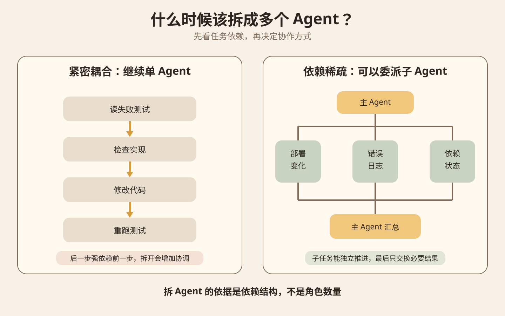
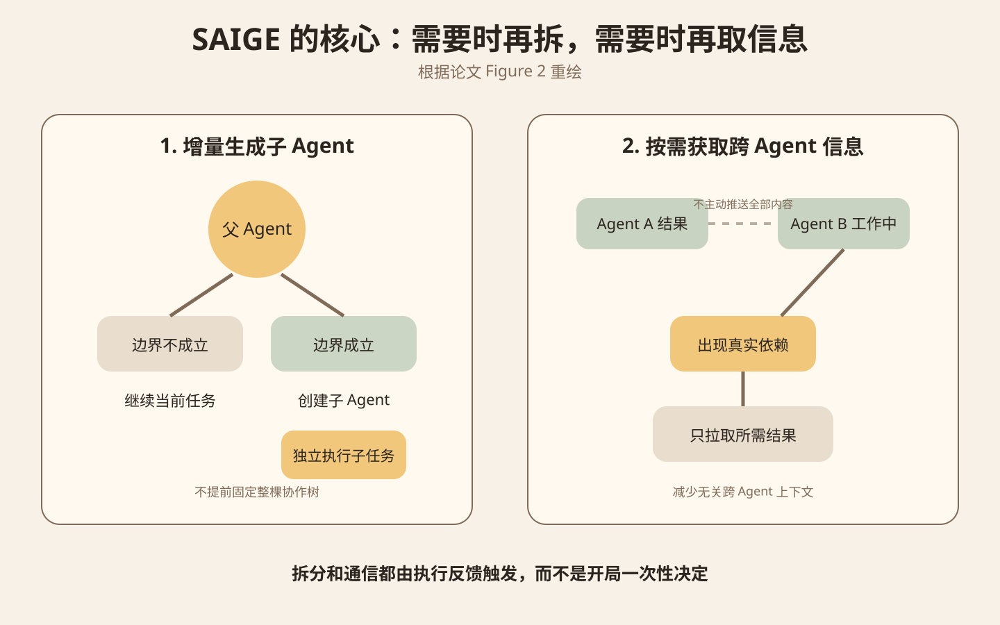
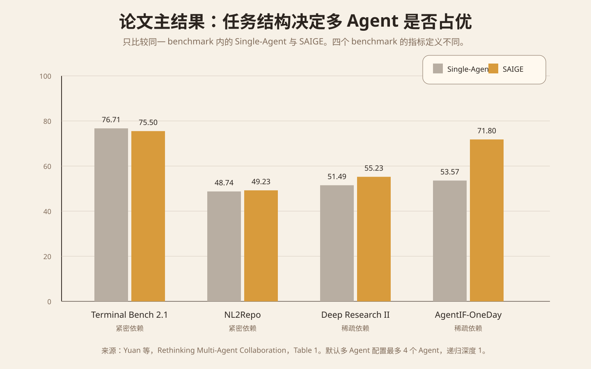
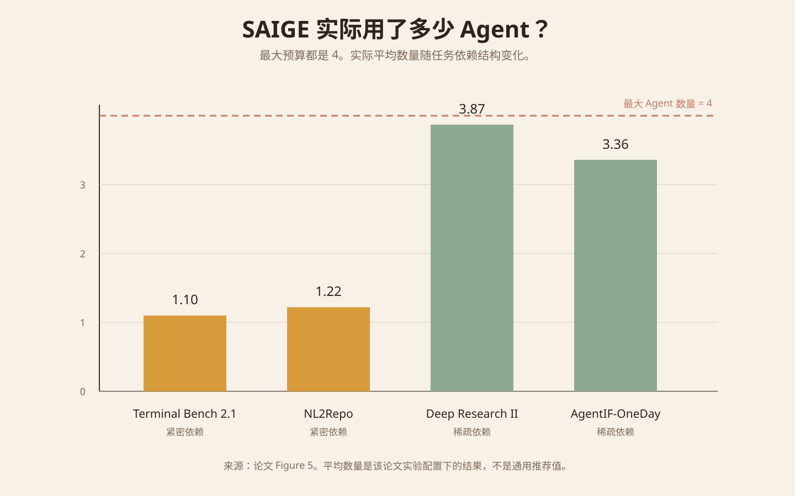

一个复杂开发任务，什么时候应该让一个 Agent 一直做到底，什么时候应该创建几个子 Agent 并行处理？

主材料是 2026 年 9 月 17 日首次提交、9 月 18 日更新到 v2 的预印本 [Rethinking Multi-Agent Collaboration: When More Is Less](https://arxiv.org/abs/2609.19759)。作者来自南京大学和上海交通大学。本文核对了论文 PDF 的方法、主实验、消融实验和附录案例，也对照了 OpenAI 当前的 [Agents API 多 Agent 文档](https://developers.openai.com/zh-Hans/api/docs/guides/agents-api/multi-agent)。本文没有复现实验，论文相关数字均来自 v2。

## 先从两个开发任务开始

任务一是修复一个失败测试。Agent 先读报错，再检查实现，修改代码，最后重跑测试。后一步明显依赖前一步。没有读到真实报错，很难正确改代码。没有看到修改结果，也不能判断下一轮该怎么做。

任务二是调查一个服务突然升高的 5xx。可以分别检查最近部署、错误日志和依赖服务状态。三个调查分支大部分时间可以独立推进，最后再由主 Agent 汇总证据。

这两个任务都可以画成多个角色，但真正决定是否值得拆 Agent 的是依赖关系。

图 1 是原文教学示意。左边的步骤构成长依赖链，拆开以后每个 Agent 都要频繁等待前一个结果。右边的三个调查分支可以独立工作，只在最后汇总。第二种结构更适合并行委派。

OpenAI 当前多 Agent 文档也给出相近的工程规则。独立任务可以交给子 Agent，短任务和互相依赖的步骤留给主 Agent。多个 Agent 如果修改同一批文件，还需要额外协调。

## 论文把依赖关系画成一张图

论文把一次完整任务看成一串执行步骤。每一步包含当前观察和 Agent 动作。作者再判断后面的步骤真正依赖前面的哪些信息，并把执行轨迹画成有向无环图。

其中一个关键概念是 bridge edge，也就是连接两个相对独立区域的关键依赖边。如果拿掉这条边，原来的依赖图会分成两个部分。

这正好对应 Agent 委派。桥的一边可以由一个 Agent 处理，另一边可以由另一个 Agent 处理。两个 Agent 不需要共享全部历史，只需要在桥接点交换必要信息。

反过来，如果依赖图到处都有跨区连接，任务就是紧密耦合。此时硬拆 Agent 会增加同步、等待和上下文传递。

论文的理论结论有明确前提。它假设完整轨迹已经知道，而且拆分点判断正确。在这个理想条件下，沿 bridge edge 拆分不会增加论文定义的上下文成本。论文也说明，这个分析没有把 context compression 等缓解手段计入。真实系统更难，因为任务还没做完时，编排器就要提前判断哪里能拆。

## SAIGE 边执行边决定要不要拆

论文提出 SAIGE，也就是 Semantic-Aware Incremental Graph Evolution。它不会在任务开始时一次性创建固定数量的 Agent。

当前 Agent 先执行。只有当执行反馈显示出现了可以相对独立处理的依赖边界时，系统才创建子 Agent。没有合适边界时，父 Agent 继续做，不强行拆分。

第二个设计是按需取消息。子 Agent 完成以后会保存结果，但其他 Agent 不会开局就收到全部内容。只有某一步确实依赖这个结果时，才读取对应信息。

图 2 根据论文 Figure 2 重绘。左边表示什么时候创建子 Agent，右边表示什么时候读取其他 Agent 的结果。两件事都由执行反馈触发。

## 多 Agent 没有在所有任务上获胜

作者在 Terminal Bench 2.1、NL2Repo、Deep Research Bench II 和 AgentIF-OneDay 四个长任务 benchmark 上比较 Single-Agent、TDAG、DynTaskMAS、GoA 和 SAIGE。为了减少 Harness 差异，所有方法都使用 Codex CLI harness，基础模型统一为 DeepSeek-V4-Pro。主实验中的多 Agent 方法最多使用 4 个 Agent，递归深度为 1。

四个 benchmark 的评分指标并不完全一样，所以只能在同一个 benchmark 内比较方法。

图 3 重绘自论文 Table 1，只保留 Single-Agent 和 SAIGE。

| Benchmark | Single-Agent | SAIGE | 依赖结构 |
| --- | ---: | ---: | --- |
| Terminal Bench 2.1 | 76.71 | 75.50 | 紧密依赖 |
| NL2Repo | 48.74 | 49.23 | 紧密依赖 |
| Deep Research Bench II | 51.49 | 55.23 | 稀疏依赖 |
| AgentIF-OneDay | 53.57 | 71.80 | 稀疏依赖 |

紧密依赖任务上，两者接近。稀疏依赖任务上，SAIGE 在这套实验配置里更占优势。这些结果不能推出 SAIGE 对所有项目都有相同提升。

Token 数据也说明多 Agent 不是免费收益。AgentIF-OneDay 上，SAIGE 的输入和输出分别是 185M 和 3M，Single-Agent 是 189M 和 2M。Deep Research Bench II 上，SAIGE 是 2745M 和 20M，Single-Agent 是 2805M 和 7M。输入上下文可能下降，但多个 Agent 的生成和协调仍会增加输出。

## Agent 越多不代表效果越好

AgentIF-OneDay 的默认配置最多 4 个 Agent，递归深度 1，得分 71.80。把最大 Agent 数提高到 5，得分降到 67.32。提高到 6，得分降到 64.02。在最多 4 个 Agent 的情况下，把递归深度提高到 2 和 3，得分分别变成 66.39 和 63.17。

Deep Research Bench II 也出现类似趋势。增加 Agent 数量或递归层级没有稳定带来提升，Token 使用量反而明显上升。

图 4 重绘自论文 Figure 5。虽然最大 Agent 预算都是 4，实际平均数量差异很大。Terminal Bench 2.1 是 1.10，NL2Repo 是 1.22，Deep Research Bench II 是 3.87，AgentIF-OneDay 是 3.36。

这组数据说明 SAIGE 在紧密依赖任务上接近单 Agent，在可拆任务上才接近用满 Agent 预算。

## 拆错以后会出现局部死锁

论文把低分轨迹里的失败分成任务理解和执行错误、工作流提前结束、local deadlock 三类。

紧密依赖任务里的多 Agent 更容易出现局部死锁。原因可能是拆分时漏掉关键依赖。一个 Agent 在等另一个 Agent 给信息，另一个 Agent 又因为缺少前者应该传来的条件而反复尝试。

附录给了一个 Terminal Bench 案例。任务要构建能在指定 JavaScript MIPS 虚拟机里运行的 ELF。错误拆分漏掉了 VM memory layout 到 build configuration 的依赖。构建 Agent 选错配置，验证 Agent 不断要求重新构建。两个 Agent 都在工作，但流程不收敛。

所以多 Agent 系统不能只记录有没有并行，还要记录谁依赖谁、等待什么、为什么再次尝试。

## 论文的边界

这篇论文目前仍是 arXiv 预印本。v1 在 2026 年 9 月 17 日提交，v2 在 9 月 18 日更新。

理论分析假设完整任务轨迹已知、拆分正确，而且没有建模 context compression。真实 Agent 做任务时看不到未来，所以实际编排只能预测拆分点。

论文在 AgentIF-OneDay 上用成功的 Single-Agent 轨迹构造 ground truth decomposition。步骤之间的语义依赖由 DeepSeek-V4-Pro 判断，不同多 Agent 方法产生的子任务也再次使用 DeepSeek-V4-Pro 做语义匹配。因此这里的 ground truth 不是独立人工标注的绝对真值。Figure 6 里的 bridge edge F1 为 0.72，只能按这套实验定义理解。

## 工程上先加一道 delegation gate

一个通用 Agent Harness 可以在创建子 Agent 以前先做 delegation gate。输入是当前任务、已知依赖和可用工具。输出只保留两个决定，继续当前 Agent，或者创建一个边界明确的子任务。

子任务至少需要问题、可用输入、允许使用的工具、预期输出和完成条件。运行日志至少记录 `parent_task_id`、`subtask_id`、`depends_on`、创建原因、输入摘要、输出摘要、等待时间、Token、最终评分和失败原因。

主要失败条件也很具体。子任务实际依赖父 Agent 尚未得到的信息，多个 Agent 同时修改同一状态，或者主 Agent 为了等待子 Agent 进入无效循环，都说明拆分边界需要重新设计。

## 一个低成本实验

下面的数字是教学实验设定，不是论文推荐值。

准备 8 个真实小任务。4 个选紧密依赖的任务，例如修复测试和按报错修改代码。4 个选稀疏依赖的任务，例如同时调查不同数据源再汇总。

A 组全部用单 Agent。B 组允许最多 4 个 Agent，但只在明确存在独立子任务时创建子 Agent。两组使用同一模型、同一工具、同一任务输入和同一验收器。

每个任务记录最终验收结果、总 Token、总耗时、实际 Agent 数、跨 Agent 消息数、等待时间，以及是否出现重复工作或局部死锁。

先看结构性结果。紧密依赖任务里，B 组应该很少创建子 Agent。稀疏依赖任务里，B 组才应该增加 Agent 数量。如果 B 组不管任务类型都稳定开满 4 个 Agent，说明编排器还没有真正利用依赖结构。

再比较质量、时间和 Token。报告时按任务结构分组，不要只看总平均分。

## 主要来源

- [Yuan 等：Rethinking Multi-Agent Collaboration: When More Is Less，arXiv v2](https://arxiv.org/abs/2609.19759)
- [论文 PDF](https://arxiv.org/pdf/2609.19759)
- [OpenAI Agents API：多 Agent](https://developers.openai.com/zh-Hans/api/docs/guides/agents-api/multi-agent)
- [OpenAI：Introducing the Agents API，2026-09-10](https://openai.com/index/introducing-the-agents-api/)
