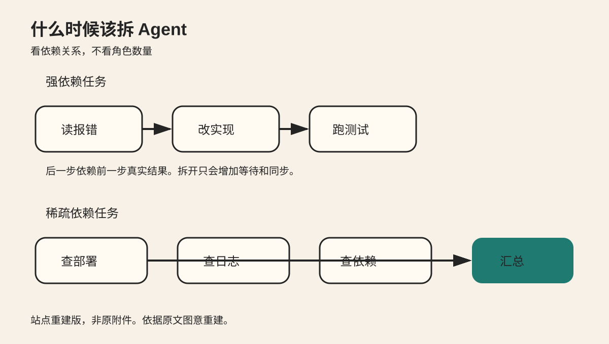
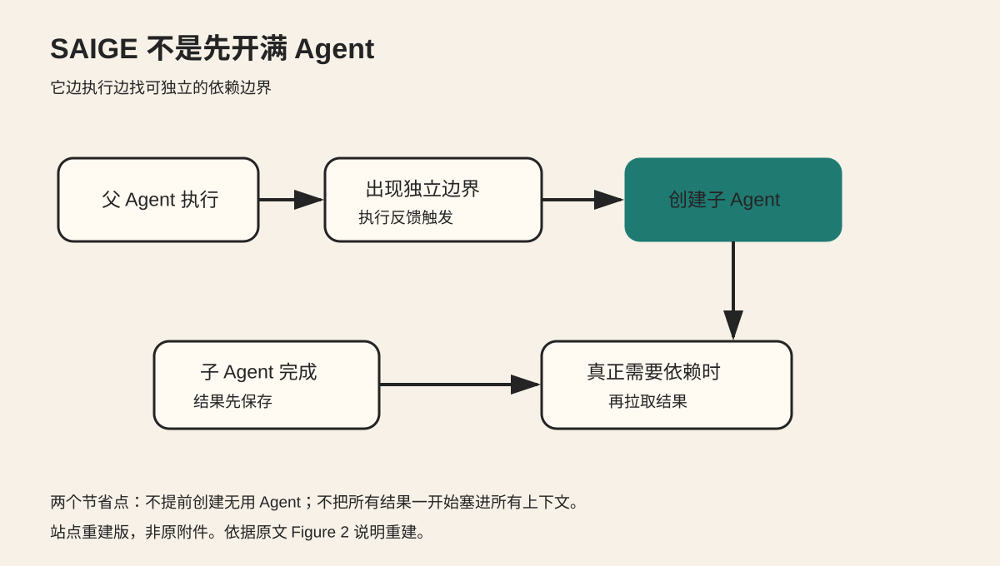
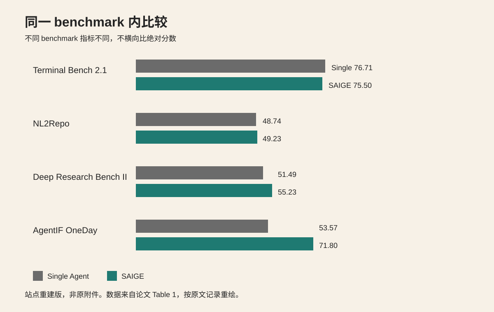
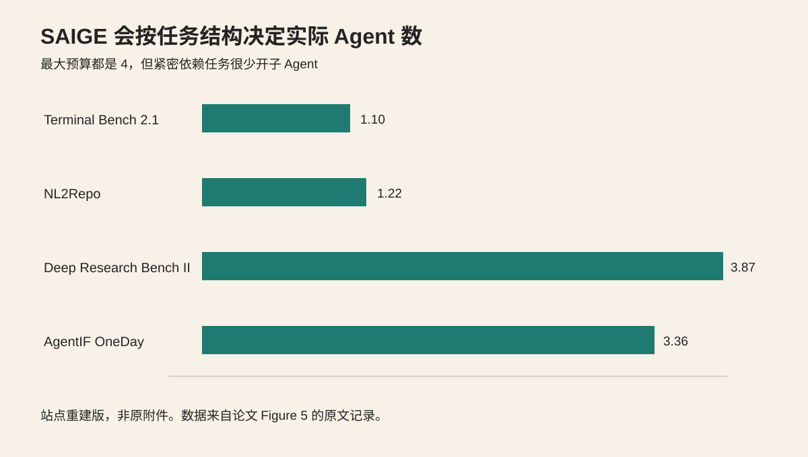

复杂任务不等于应该多开 Agent。真正需要看的，是任务里有多少步骤可以独立推进，以及不同步骤之间要交换多少上下文。

主材料是 2026 年 9 月 18 日更新到 v2 的预印本 [Rethinking Multi-Agent Collaboration: When More Is Less](https://arxiv.org/abs/2609.19759)。本文没有复现实验。所有实验数字都来自论文 v2，并对照了 OpenAI 当前的 [Agents API 多 Agent 文档](https://developers.openai.com/zh-Hans/api/docs/guides/agents-api/multi-agent)。

## 先看两种任务

修复一个失败测试时，Agent 通常要先读报错，再检查实现，再修改代码，最后重跑测试。后一步依赖前一步的真实结果。把这些步骤硬拆给多个 Agent，会增加等待、同步和上下文传递。

调查服务 5xx 时则不同。最近部署、错误日志、依赖服务状态可以分别调查，最后再汇总证据。这类任务有更多独立分支，更适合并行委派。

图 1 是站点重建版，非 Notion 原附件。它保留原文的核心对比。左边是长依赖链，右边是可并行调查后汇总的分支。

OpenAI 的多 Agent 文档也给出相近的工程建议。独立任务适合交给子 Agent。短任务和互相依赖的步骤更适合留给主 Agent。多个 Agent 同时修改同一批文件时，还需要额外协调。

## 论文把执行轨迹看成依赖图

论文把一次任务拆成连续执行步骤，再判断后续步骤真正依赖哪些早期信息。如果删掉某一步会明显影响后续决策，就把两步之间视为存在依赖。

这样可以得到一张有向无环图。

论文特别关注 bridge edge。可以把它理解成连接两个相对独立区域的关键依赖。如果沿着正确的桥接点拆分，两边可以分别执行，只在必要位置交换信息。

如果依赖图到处都有跨区连接，说明任务本身紧密耦合。此时增加 Agent 数量只会制造更多同步。

论文的理论分析有明确前提。它假设完整轨迹已经知道，而且拆分点判断正确。真实系统做任务时看不到未来，所以实际编排器只能根据当前反馈预测哪里值得拆。

## SAIGE 边执行边决定是否委派

论文提出 SAIGE，也就是 Semantic-Aware Incremental Graph Evolution。

它不会在任务开始时固定创建一批 Agent。父 Agent 先执行。只有当前反馈出现相对独立的依赖边界时，系统才创建子 Agent。

子 Agent 完成后，结果也不会立刻广播给所有 Agent。只有某一步真正需要该依赖时，才读取对应结果。

图 2 是站点重建版，非 Notion 原附件。它保留两个关键动作。第一，执行反馈触发创建子 Agent。第二，依赖真正出现时再读取结果。

这减少两类浪费。任务本来不需要拆时，不提前创建 Agent。结果暂时用不到时，也不把它塞进所有上下文。

## 多 Agent 没有在所有 benchmark 上获胜

作者在 Terminal Bench 2.1、NL2Repo、Deep Research Bench II 和 AgentIF-OneDay 上比较 Single-Agent 与多种多 Agent 方法。主实验统一使用 Codex CLI harness，基础模型为 DeepSeek-V4-Pro。多 Agent 方法最多使用 4 个 Agent，递归深度为 1。

四个 benchmark 的评分指标不同，所以只能在同一 benchmark 内比较。

图 3 是站点重建版，非 Notion 原附件。数据来自论文 Table 1。

Terminal Bench 2.1 上，Single-Agent 是 76.71，SAIGE 是 75.50。NL2Repo 上分别是 48.74 和 49.23。两组差距都很小。

Deep Research Bench II 上，Single-Agent 是 51.49，SAIGE 是 55.23。AgentIF-OneDay 上分别是 53.57 和 71.80。

这些结果不能推出“多 Agent 普遍更强”。它们更支持一个具体判断。依赖较稀疏的任务给并行委派留下了更多空间，依赖紧密的任务则未必受益。

论文还记录了 token 使用。多 Agent 可以减少部分重复输入，但多个 Agent 的生成和协调会增加输出成本，所以它不是免费的扩展方式。

## Agent 越多不代表越强

论文的消融实验继续增加 Agent 数量和递归深度，结果没有稳定提升。

AgentIF-OneDay 默认最多 4 个 Agent、递归深度 1，得分 71.80。把最大 Agent 数提高到 5，得分降到 67.32。提高到 6，降到 64.02。保持最多 4 个 Agent，把递归深度增加到 2 和 3，得分分别变成 66.39 和 63.17。

Deep Research Bench II 也出现类似趋势。更多 Agent 和更深递归没有稳定提高结果，token 使用却继续增加。

图 4 是站点重建版，非 Notion 原附件。数据来自论文 Figure 5 的原文记录。

虽然最大预算都是 4 个 Agent，SAIGE 实际使用数量差异很大。Terminal Bench 2.1 平均 1.10 个，NL2Repo 1.22 个，Deep Research Bench II 3.87 个，AgentIF-OneDay 3.36 个。

这个结果比“固定开几个 Agent”更有用。编排器应该让实际 Agent 数随任务结构变化。

## 拆错以后会出现局部死锁

论文把失败轨迹中的问题分成任务理解和执行错误、工作流提前结束、local deadlock 三类。

局部死锁常出现在依赖被拆错以后。一个 Agent 在等另一个 Agent 的信息，另一个 Agent 又因为缺少前者本该传来的条件而反复尝试。两个 Agent 都在运行，但整个任务不再收敛。

这说明多 Agent 系统不能只记录谁在并行。至少还要记录父任务和子任务 ID、依赖关系、创建原因、输入输出摘要、等待时间、token 使用、最终验收结果和失败原因。

没有这些信息，协调失败很容易被误判成模型能力不足。

## 一个低成本实验

可以准备 8 个真实小任务。

其中 4 个选强依赖任务，比如修测试和按报错修改代码。另外 4 个选稀疏依赖任务，比如分别调查不同数据源再汇总。

A 组全部用单 Agent。B 组允许最多 4 个 Agent，但只有明确存在独立子任务时才能创建。

两组使用同一模型、同一工具、同一输入和同一验收器。记录最终结果、总 token、总耗时、实际 Agent 数、跨 Agent 消息数、等待时间，以及是否出现重复工作或局部死锁。

先检查结构性结果，而不是只看总平均分。

强依赖任务里，B 组应该很少创建子 Agent。稀疏依赖任务里，B 组才应该增加 Agent 数量。如果 B 组不管任务类型都稳定开满 4 个 Agent，说明编排器还没有真正识别依赖结构。

## 结论

多 Agent 的价值不是角色更多，而是把相对独立的工作放进独立上下文。

真正困难的是判断依赖边界。拆错以后，原本会收敛的任务可能变成等待和重复尝试。

增加 Agent 数量和递归层级也不是稳定的扩展方法。先建立单 Agent 基线，再让实际 Agent 数随任务结构变化。

## 主要来源

- [Rethinking Multi-Agent Collaboration: When More Is Less，arXiv v2](https://arxiv.org/abs/2609.19759)
- [论文 PDF](https://arxiv.org/pdf/2609.19759)
- [OpenAI Agents API，多 Agent](https://developers.openai.com/zh-Hans/api/docs/guides/agents-api/multi-agent)
- [OpenAI：Introducing the Agents API](https://openai.com/index/introducing-the-agents-api/)
