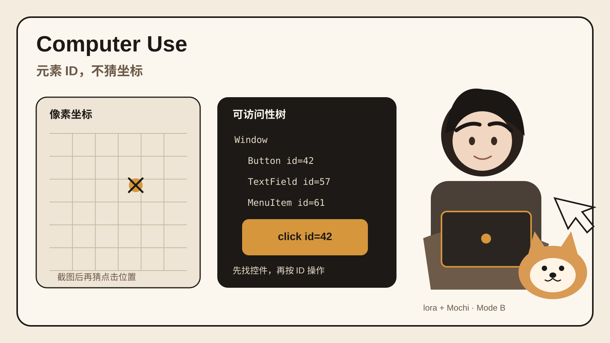

## 核心判断
Computer Use 的关键问题不是模型会不会看截图，而是 Agent 能不能稳定找到控件，并把动作送到正确窗口。
这个项目把可访问性树放在截图前面。Agent 先获得 `Button id=42` 这类结构化目标，再执行点击。截图留给验证和视觉内容。
这套设计减少了纯坐标操作对分辨率、缩放和窗口位置的依赖。
## 30 秒看懂
很多桌面 Agent 先截图，再让模型猜按钮坐标。
Computer Use 先调用 `get_app_state` 读取系统可访问性树。按钮、输入框和菜单会带稳定元素 ID。Agent 找到目标后按 ID 操作。
需要看画布、小字或结果时，再用 screenshot 和 zoom 验证。
它还把输入发到目标窗口，所以 Agent 工作时，用户鼠标可以继续使用。
## 为什么有意思
它把 Computer Use 拆成了两个不同问题：找到控件，以及执行动作。
可访问性树负责找到控件。截图负责补充视觉信息和验证结果。这样比每一步都重新看整张屏幕更容易调试。
后台输入也有实际价值。桌面 Agent 如果持续抢鼠标和焦点，长任务很难和人的正常工作同时进行。这个项目直接在执行层处理这个冲突。
## 3 个值得借鉴的设计
### 1. 先找元素 ID，再执行动作
`get_app_state` 返回结构化控件。Agent 可以按标签查询，再对具体 ID 调用 click、set_value 或 select_text。失败时也更容易知道是感知错了，还是动作错了。
### 2. 把截图放到验证环节
截图不是唯一感知入口。官方推荐的循环是先读取状态，执行动作，再重新读取状态或截图检查结果。做 Agent Eval 时，可以分别记录感知、动作和验证三个事件。
### 3. 跨平台保持同一工具契约
macOS、Windows、Linux 的底层实现不同，但 MCP 工具名称和参数保持一致。模型学会一次工具调用后，不需要为三个系统换一套接口。
## 与我的连接
这个项目适合直接接进你关注的 Agent Harness 和 Eval。
如果你做桌面 Agent 评测，可以把一次任务拆成可记录事件：`get_app_state` 找到目标控件，动作工具执行，随后用状态或截图验证。这样能区分 Agent 是看错了、点错了，还是没有检查结果。
如果你要让 Codex 或 Claude Code 操作本地应用，这个项目也省掉了自己写 macOS、Windows、Linux 三套控制接口的工作。

## 来源与事实核验
- 项目名称是 Computer Use。仓库为 `munimtechnologies/computer-use`。
- 维护方是 Munim Technologies。项目是 MT Code 的 Computer Use 引擎，也单独开源。
- 项目通过 MCP stdio 接给 Claude Code、Codex、Cursor、MT Code 和其他 MCP 客户端。
- `get_app_state` 先返回应用的可访问性树和稳定元素 ID。Agent 可以按元素 ID 点击、输入和选择。截图主要用于验证，以及处理可访问性树无法描述的内容。
- 点击、输入和滚动会发送到目标窗口。官方说明用户鼠标不会被移动，窗口焦点也不会被抢走。
- 项目提供 26 个工具。macOS、Windows、Linux 使用相同的工具名称和参数结构。
- macOS 端使用 Swift、Accessibility API 与 ScreenCaptureKit。Windows 和 Linux 端使用 Rust。Windows 使用 UI Automation，Linux 使用 AT-SPI 与 X11。
- Linux 的元素操作可用。原生 Wayland 应用的坐标点击受限，需要 X11 或 XWayland 客户端提供绝对几何信息。
- Chrome 扩展可以在用户已登录的 Chrome 中创建独立标签组。Agent 不需要接管用户自己的标签页。
- LICENSE 是 Apache License 2.0。
- 最新公开 Release 是 `v0.1.0`，发布时间为 2026-09-05。官方提供 macOS universal 与 Windows x64 预编译包。Linux 当前按 README 从源码构建。
- 仓库状态抓取时间为 2026-09-10 09:21 +08:00。公开仓库最近一批同步提交日期为 2026-09-05。
## 证据卡
1. [Munim Technologies 官方页面](https://www.munimtech.com/computer-use) 说明可访问性树、后台输入、跨平台工具面和安装方式。
2. [GitHub 官方仓库](https://github.com/munimtechnologies/computer-use) 提供 README、源码布局、MCP 配置、26 个工具和平台限制。
3. [Apache 2.0 LICENSE](https://github.com/munimtechnologies/computer-use/blob/main/LICENSE) 可直接核验许可证。
4. [v0.1.0 Release](https://github.com/munimtechnologies/computer-use/releases/tag/v0.1.0) 记录首个公开版本、macOS 与 Windows 构建包及校验文件。
