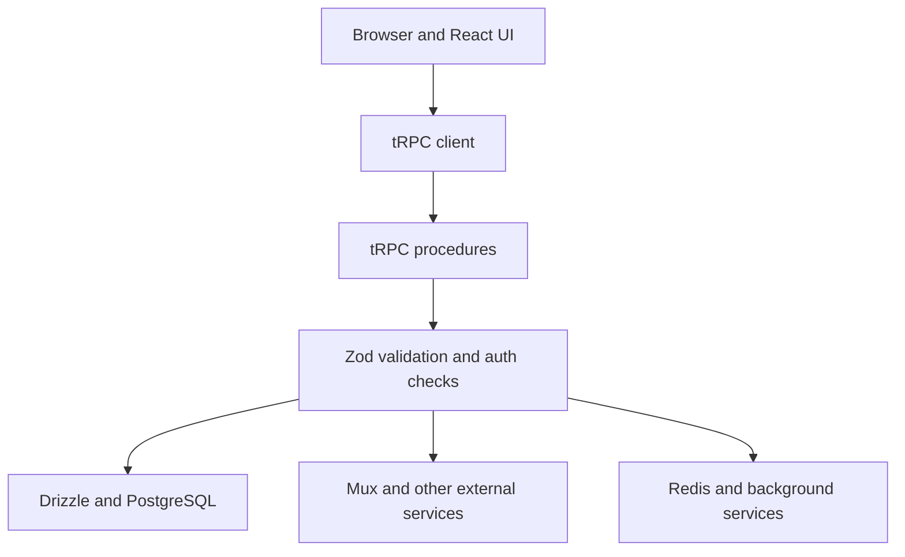

## Introduction

NewTube is a YouTube-style full-stack project built with Next.js 15, React, tRPC, Drizzle, Clerk, Mux and related managed services. This article focuses on how the repository is organized and how requests move through the application.

**GitHub Repository**: [NewTube Clone](https://github.com/lora-sys/Newtube-clone)

**Source and setup instructions**: [NewTube Clone on GitHub](https://github.com/lora-sys/Newtube-clone). A hosted demo is not currently published.

<Callout tone="note" title="Verification scope">
The article describes the repository and its intended service integrations. A hosted production deployment is not currently available, so claims about runtime scale or production behavior should be verified against the code and service configuration before reuse.
</Callout>

---

## Project Overview

### Implemented surface

NewTube implements the following repository features:

- Video upload and HLS playback through Mux
- Clerk-backed sign-in and user mapping
- Creator screens for video management
- Creator subscriptions
- Comments and reactions
- Playlists
- Hooks for generating titles, descriptions, and thumbnails
- Responsive layouts for desktop and mobile

### Tech stack

| Layer    | Technology                                     |
| -------- | ---------------------------------------------- |
| Frontend | Next.js 15, React 19, TypeScript, Tailwind CSS |
| Backend  | tRPC, Drizzle ORM                              |
| Database | PostgreSQL (Neon)                              |
| Auth     | Clerk                                          |
| Video    | Mux                                            |
| Storage  | UploadThing                                    |
| Cache    | Upstash Redis                                  |
| Queue    | QStash                                         |

---

## Architecture

### System architecture

The repository separates the browser and React layer, the tRPC API layer, and data or external-service access. The important boundary is that UI code calls typed procedures instead of reaching directly into database or service clients.



### Project Structure

I organized the codebase using a **feature-based module structure** :

```
modules/
├── videos/
│   ├── server/
│   │   └── procedures.ts    # tRPC API endpoints
│   ├── ui/
│   │   └── components/      # React components
│   └── type.ts              # TypeScript types
├── comments/
├── subscriptions/
├── playlists/
└── ... (other features)
```

This layout keeps server procedures, UI code, and feature types close to the feature that uses them.

### Request Flow Example

Here's how a typical API request flows through the system:

```typescript
// 1. Client Component triggers the query
const [videos] = trpc.videos.getMany.useSuspenseQuery({
	categoryId: selectedCategory
});

// 2. tRPC Client serializes and sends request
// POST /api/trpc/videos.getMany
// Body: { json: { categoryId: "..." } }

// 3. Server-side tRPC handles the request
export const videosRouter = createTRPCRouter({
	getMany: baseProcedure
		.input(
			z.object({
				categoryId: z.string().uuid().optional(),
				limit: z.number().min(1).max(100).default(10)
			})
		)
		.query(async ({ input }) => {
			// Database query with Drizzle ORM
			const data = await db
				.select({
					id: videos.id,
					title: videos.title
					// ... other fields
				})
				.from(videos)
				.where(eq(videos.videoVisiblity, 'public'));

			return { items: data, nextCursor: null };
		})
});
```

---

## Core Technologies and Features

### 1. Server Components with SSR Prefetching

Next.js 15's App Router allows us to prefetch data on the server and hydrate it to the client:

```tsx
// app/(home)/videos/[videoId]/page.tsx (Server Component)
import { HydrateClient, trpc } from '@/trpc/server';

export default async function VideoPage({ params }: { params: { videoId: string } }) {
	// Prefetch on the server
	void trpc.videos.getOne.prefetch({ id: params.videoId });
	void trpc.comments.getMany.prefetch({ videoId: params.videoId });

	return (
		<HydrateClient>
			<VideoSection videoId={params.videoId} />
		</HydrateClient>
	);
}

// VideoSection.tsx (Client Component)
('use client');

export function VideoSection({ videoId }: { videoId: string }) {
	// Data is already prefetched - no loading state!
	const [video] = trpc.videos.getOne.useSuspenseQuery({ id: videoId });

	return <VideoPlayer video={video} />;
}
```

**Benefits**:

- Avoids a separate client fetch for data that was prefetched on the server
- Better SEO with server-rendered content
- Reduced client-side JavaScript

### 2. Type-Safe API Layer with tRPC

tRPC provides end-to-end type safety without code generation:

```typescript
// Backend: trpc/router/videos.ts
export const videosRouter = createTRPCRouter({
	create: protectedProcedure.mutation(async ({ ctx }) => {
		const upload = await mux.video.uploads.create({
			new_asset_settings: {
				playback_policies: ['public'],
				inputs: [
					{
						generated_subtitles: [
							{
								language_code: 'en',
								name: 'English'
							}
						]
					}
				]
			},
			cors_origin: process.env.MUX_CORS_ORIGIN || '*'
		});

		const [video] = await db
			.insert(videos)
			.values({
				userId: ctx.user.id,
				title: 'Untitled',
				muxStatus: 'waiting',
				muxUploadId: upload.id
			})
			.returning();

		return { video, url: upload.url };
	})
});

// Frontend: Auto-completion and type checking
const createMutation = trpc.videos.create.useMutation();
//     ^? { video: Video, url: string } - fully typed!
```

### 3. Authentication Middleware with Caching

The authentication flow is optimized with a three-tier caching strategy:

```typescript
// trpc/init.ts
export const protectedProcedure = t.procedure.use(async (opts) => {
	const { ctx } = opts;

	if (!ctx.clerkUserId) {
		throw new TRPCError({ code: 'UNAUTHORIZED' });
	}

	// Tier 1: Check JWT publicMetadata (fastest)
	if (ctx.dbUserId) {
		return opts.next({ ctx: { user: { id: ctx.dbUserId } } });
	}

	// Tier 2: Check Redis cache
	const cachedDbId = await redis.get(`user:dbId:${ctx.clerkUserId}`);
	if (cachedDbId) {
		return opts.next({ ctx: { user: { id: cachedDbId } } });
	}

	// Tier 3: Database query (fallback)
	const [user] = await db.select().from(users).where(eq(users.clerkId, ctx.clerkUserId));

	// Cache for future requests
	await redis.set(`user:dbId:${ctx.clerkUserId}`, user.id, { ex: 3600 });

	// Update JWT for next time
	await clerkClient.users.updateUserMetadata(ctx.clerkUserId, {
		publicMetadata: { dbUserId: user.id }
	});

	return opts.next({ ctx: { user } });
});
```

### 4. Video Processing Pipeline

The video upload and processing flow uses webhooks for async updates:

```
User Upload → Mux Upload URL → Mux Processing → Webhook → Database Update
     │              │                │               │            │
     └──────────────┴────────────────┴───────────────┴────────────┘
                    Asynchronous flow with real-time updates
```

```typescript
// app/api/videos/webhook/route.ts
export async function POST(req: Request) {
	const payload = await req.json();

	switch (payload.type) {
		case 'video.asset.ready': {
			const asset = payload.data;
			const playbackId = asset.playback_ids[0].id;

			// Generate thumbnail from Mux
			const thumbnailUrl = `https://image.mux.com/${playbackId}/thumbnail.jpg`;
			const uploaded = await utapi.uploadFilesFromUrl(thumbnailUrl);

			// Update database
			await db
				.update(videos)
				.set({
					muxPlaybackId: playbackId,
					muxStatus: 'ready',
					duration: Math.round(asset.duration),
					thumbnailUrl: uploaded.data.ufsUrl
				})
				.where(eq(videos.muxUploadId, asset.upload_id));

			break;
		}
	}

	return new Response('OK');
}
```

### 5. AI-assisted metadata generation

Using QStash for async AI tasks:

```typescript
// Trigger AI task
const { workflowRunId } = await workflow.trigger({
	url: `${process.env.QSTASH_WORKFLOW_URL}/api/videos/workflows/title`,
	body: { userId, videoId }
});

// Workflow handler
export async function POST(req: Request) {
	const { videoId } = await req.json();

	// Get video transcript from Mux
	const track = await mux.video.tracks.get(video.muxTrackId);
	const transcript = track.text;

	// Generate title with AI
	const response = await openai.chat.completions.create({
		model: 'gpt-4',
		messages: [
			{
				role: 'user',
				content: `Generate a YouTube title based on: ${transcript}`
			}
		]
	});

	const title = response.choices[0].message.content;

	// Update database
	await db.update(videos).set({ title }).where(eq(videos.id, videoId));
}
```

### 6. Optimistic updates and rollback

```typescript
const utils = trpc.useUtils();

const likeMutation = trpc.videoReactions.like.useMutation({
	onMutate: async ({ videoId }) => {
		// Cancel outgoing refetches
		await utils.videos.getOne.cancel({ id: videoId });

		// Snapshot previous value
		const previous = utils.videos.getOne.getData({ id: videoId });

		// Optimistically update UI
		utils.videos.getOne.setData({ id: videoId }, (old) => ({
			...old!,
			viewerReaction: 'like',
			likeCount: old!.likeCount + 1
		}));

		return { previous };
	},
	onError: (err, { videoId }, context) => {
		// Rollback on error
		utils.videos.getOne.setData({ id: videoId }, context.previous);
		toast.error('Failed to like video');
	},
	onSettled: ({ videoId }) => {
		// Refetch to ensure consistency
		utils.videos.getOne.invalidate({ id: videoId });
		utils.playlists.getLiked.invalidate();
	}
});
```

---

## Problems encountered

### Challenge 1: SSR Authentication with Protected Routes

**Problem**: When using SSR with protected routes, the server doesn't have access to the client's authentication state, causing 401 errors or hydration mismatches.

**Solution**: Implement a multi-layered approach:

```typescript
// In protected components
"use client";

import { useAuth, useClerk } from "@clerk/nextjs";
import { useEffect, useRef } from "react";

export function ProtectedSection() {
  const { isSignedIn, isLoaded } = useAuth();
  const { openSignIn } = useClerk();
  const hasTriggeredSignIn = useRef(false);

  useEffect(() => {
    // Prevent multiple calls with useRef
    if (isLoaded && !isSignedIn && !hasTriggeredSignIn.current) {
      hasTriggeredSignIn.current = true;
      openSignIn();
    }
  }, [isLoaded, isSignedIn, openSignIn]);

  if (!isLoaded) {
    return <Skeleton />;
  }

  if (!isSignedIn) {
    return null;
  }

  return <ActualContent />;
}
```

**Key Insight**: Using `useRef` prevents the sign-in modal from opening multiple times during React's strict mode double-render.

### Challenge 2: Hydration Mismatch in Mobile Detection

**Problem**: A mobile detection hook caused hydration errors because the initial value differed between server and client.

```typescript
// ❌ Problem: undefined on server, boolean on client
const [isMobile, setIsMobile] = useState<boolean | undefined>(undefined);
return !!isMobile;
```

**Solution**: Default to `false` and only update on client:

```typescript
// ✅ Fixed: Consistent initial value
const [isMobile, setIsMobile] = useState<boolean>(false);

useEffect(() => {
	const checkMobile = () => {
		setIsMobile(window.innerWidth < 768);
	};

	checkMobile();
	window.addEventListener('resize', checkMobile);
	return () => window.removeEventListener('resize', checkMobile);
}, []);

return isMobile;
```

### Challenge 3: Cache Invalidation Across Features

**Problem**: When a user likes a video, the "Liked Videos" playlist wasn't updating in real-time.

**Solution**: Invalidate all related queries:

```typescript
const likeMutation = trpc.videoReactions.like.useMutation({
	onSuccess: () => {
		// Primary data
		utils.videos.getOne.invalidate({ id: videoId });

		// Related features
		utils.playlists.getLiked.invalidate();
		utils.playlists.getLikedPreview.invalidate();
	}
});
```

### Challenge 4: CORS Configuration for Video Uploads

**Problem**: In production, Mux uploads failed due to CORS restrictions.

**Solution**: Use environment-based CORS configuration:

```typescript
const upload = await mux.video.uploads.create({
	new_asset_settings: {
		/* ... */
	},
	// Development: "*" | Production: specific domain
	cors_origin: process.env.MUX_CORS_ORIGIN || '*'
});
```

### Challenge 5: Real-time Video Processing Status

**Problem**: Users couldn't see when their video finished processing.

**Solution**: Implement polling with automatic cleanup:

```typescript
const [workflowRunId, setWorkflowRunId] = useState<string | null>(null);

useEffect(() => {
	if (!workflowRunId) return;

	const interval = setInterval(() => {
		// Invalidate cache to refetch latest data
		utils.studio.getOne.invalidate({ id: videoId });
	}, 2000);

	// Cleanup after 60 seconds
	const timeout = setTimeout(() => {
		clearInterval(interval);
		toast.info('Processing may take longer than expected');
	}, 60000);

	return () => {
		clearInterval(interval);
		clearTimeout(timeout);
	};
}, [workflowRunId, videoId, utils]);
```

---

## What the repository demonstrates

The useful part of this project is the set of boundaries it makes explicit. React components do not query PostgreSQL directly. tRPC procedures own input validation and authorization. Mux handles video processing outside the request path. Client mutations can update optimistically, but they also keep rollback and invalidation paths.

The repository also shows several limits that still need production verification. A hosted deployment is not published, so this article does not claim measured scale, latency, cache hit rate, or SEO improvement. The three-tier auth cache, polling loop, and CORS configuration should be treated as implementation choices to test under the deployment that actually uses them.

## Next work

The next useful steps are concrete: publish a hosted environment, measure the video-processing path, replace polling where event delivery is available, add failure tests around upload and auth boundaries, and document which AI metadata features are enabled in production.

## Resources

- [NewTube Clone repository](https://github.com/lora-sys/Newtube-clone)
- [Next.js documentation](https://nextjs.org/docs)
- [tRPC documentation](https://trpc.io/docs)
- [Drizzle ORM documentation](https://orm.drizzle.team/)
