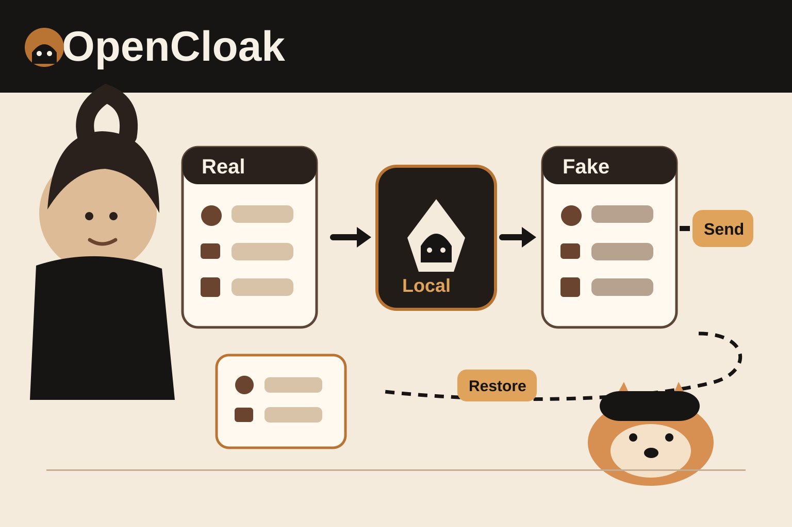

# 事实核验
- 项目名称：OpenCloak。
- 作者：Arik Chakma。官方仓库是 [arikchakma/opencloak](https://github.com/arikchakma/opencloak)。
- 核心功能：浏览器扩展在本机检查提示词里的个人信息，把检测到的值替换成可持续映射的假值，再发送给 AI。
- 恢复机制：模型回复回来后，扩展在本地把假值恢复成用户原来的称呼，并标出模型实际看到的假值。
- 本地检测：README 说明检测模型通过 WebGPU 在浏览器内运行，没有服务端，也不要求账户。
- 发送前确认：扩展会先展示实际要发送的版本。用户可以保留真实值，也可以重新生成某个假值。
- 支持站点：README 列出 ChatGPT、Claude、Gemini、Perplexity、Grok 和 DeepSeek。
- 安装方式：官方 v0.1.1 Release 提供 `opencloak-0.1.1-chrome.zip`，可按 README 通过 Chrome 的 Load unpacked 安装。
- LICENSE：MIT。第三方模型、数据和依赖保留各自许可证。
- 最新 Release：v0.1.1，发布时间是 2026-09-20 04:34 +08:00。该版本修复了流式回复里假值跨文本节点时的恢复匹配。
- 当前状态：仓库公开且未归档。README 明确把检测模型标为实验性质。
- Demo：README 有项目缩略图和完整安装步骤。仓库没有单独列出公开 Web Demo。最可靠的演示方式是安装官方 Release 后录制真实扩展操作。
# 已知边界
- 作者明确提醒，扫描没有发现明显个人信息，不代表内容一定安全。
- README 说明目前针对发送前提前上传行为的 guard 只覆盖 ChatGPT。其他站点可能在按下发送前上传内容。
- 如果扩展无法可靠改写提示词，它会拒绝发送，而不是把原文直接放过去。
- 假值如果碰巧是常见词，回复恢复时可能替换到不该替换的位置。
# 证据卡
1. [官方 README](https://github.com/arikchakma/opencloak/blob/main/README.md)：核验本地 WebGPU 检测、替换与恢复机制、支持站点、安装步骤和已知边界。
2. [官方仓库](https://github.com/arikchakma/opencloak)：核验作者、仓库状态、MIT LICENSE 和当前源码。
3. [v0.1.1 Release](https://github.com/arikchakma/opencloak/releases/tag/v0.1.1)：核验当前可下载的 Chrome 包和最新修复。
# 30 秒看懂
OpenCloak 是一个 Chrome 扩展。你准备把一段提示词发给 AI 时，它先在浏览器本地检查姓名、邮箱、地址等个人信息，再把这些值换成假值。发送前，你能看到模型实际会收到什么。模型回复回来后，OpenCloak 再在本地把假值恢复成原来的称呼。
它真正有意思的地方不是“自动脱敏”四个字，而是替换发生在发送边界，而且映射可以恢复。模型看到的是假值，用户继续用自己的真实称呼读对话。
# 为什么有意思
很多隐私工具只做删除。删除会让上下文断掉。OpenCloak 选择稳定替换。同一个真实值持续映射到同一个假值，所以多轮对话还能保持人物和对象关系。
它也把发送前预览做成了产品步骤。用户能看到即将离开设备的版本，而不是只能相信后台规则已经处理过。
另一个值得看的是失败策略。如果扩展不能安全改写提示词，它会拒绝发送。这个选择比静默回退到原文更适合隐私边界。
# 3 个值得借鉴的设计
## 1. 在发送边界处理敏感字段
处理发生在内容离开设备之前。这个位置最容易解释，也最容易让用户检查结果。
## 2. 用稳定假值保留上下文
同一个真实值保持同一个替代值。对话里的关系不会因为每轮重新随机而失真。
## 3. 改写失败就停止发送
隐私层不能成功工作时，系统拒绝继续。这比默认放行更可控。
# 与我的连接
这个机制适合迁移到你做 Agent 产品时的输入网关。比如 CRM、预约、客服和多 Agent 协作里，用户姓名、邮箱、手机号可以先在本地或受控网关映射，再进入模型和第三方工具。需要展示结果时，再在可信边界恢复。
要注意，OpenCloak 本身是浏览器提示词个人信息工具。它不是 API Key 或代码 Secret 扫描器。做 Agent Harness 时可以借它的边界设计，但不能直接把它当成通用 Secret 防泄漏方案。
