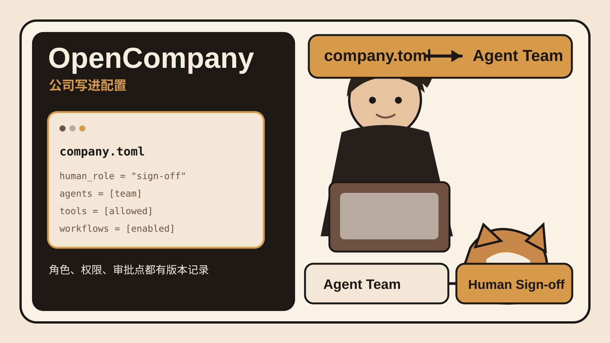

## 事实核验
- 项目名称：OpenCompany。
- 组织：Tiny Humans，GitHub 组织为 `tinyhumansai`。
- 官方定位：为一人业务提供 Agent 团队运行层。
- 核心结构：每个公司位于 `companies/` 下。`company.toml` 定义公司信息、Agent 组织、工具权限、群组、连接、工作流和策略。
- 人工控制：公司配置可以写明 `human_role`。官方 Marketing Agency 示例写的是 `Campaign review and sign-off`。
- 工具权限：Marketing Agency 示例将公司、desk 和 Agent 的工具权限分层收窄。配置注释明确说明这些权限按层级取交集。
- Demo：官方 README 提供 `launch-demo.sh`。启动后可打开本地 Operator Console 查看 Agent 工作并处理等待人工确认的事项。
- 模型与运行：真实 Agent 工作需要 TinyHumans API key，以使用 Medulla。没有 key 时仍可启动并查看界面，但 Agent 不执行真实工作。
- 当前版本：v0.1.4。GitHub Release 发布时间为 2026-09-11 21:55 UTC。检索时间为 2026-09-11 17:48，UTC-08:00。
- 当前状态：源码和本地 Demo 可用。官方 README 明确标注 WIP，并写明 `Not production-ready`。官网目前仍有 waitlist。
- LICENSE：GPL-3.0。
- 动态信息：官方 README 当前列出 22 个 company 模板。该数字检索于 2026-09-11 17:48，UTC-08:00，后续可能变化。
## 证据区

1. [OpenCompany 官网](https://tinyhumans.ai/opencompany) 显示产品定位和当前 waitlist 状态。
2. [官方 GitHub 仓库](https://github.com/tinyhumansai/opencompany) 提供本地运行、Demo、模板目录、WIP 状态和架构说明。
3. [Marketing Agency 的 company.toml](https://github.com/tinyhumansai/opencompany/blob/main/companies/marketing_agency/company.toml) 展示 `human_role`、工具权限、群组、连接、工作流和策略。
4. [v0.1.4 Release](https://github.com/tinyhumansai/opencompany/releases/tag/v0.1.4) 于 2026-09-11 发布。
5. [LICENSE](https://github.com/tinyhumansai/opencompany/blob/main/LICENSE) 为 GPL-3.0。
## 30 秒看懂
OpenCompany 把“公司”当成一个可以运行的配置包。
每家公司是一个目录。`company.toml` 写清公司名称、人的职责、Agent 团队、工具权限、群组、连接、工作流和策略。Host 读取这些配置后实例化 Agent。人只在配置指定的节点做审批或决策。
它今天发布了 v0.1.4。源码和本地 Demo 可以运行，但官方仍把项目标成 WIP，并明确说还不能按生产系统依赖。
## 核心判断
最值得借鉴的不是“一人公司”这个口号，而是把组织设计变成配置文件。
如果角色、权限和人工审批只存在于 prompt 里，系统很难审计，也很难比较两次改动。写进 `company.toml` 后，这些规则能进 Git、能做 diff，也能在部署前检查。
## 为什么有意思
很多多 Agent Demo 先画组织图，再让不同 Agent 互相发消息。OpenCompany 往前多走了一步。它把组织图对应到可执行配置。
Marketing Agency 的 manifest 里可以直接看到人的签字职责、Agent 所在的 desk、允许使用的工具、连接到 Slack 或 Gmail 的意图、启用的工作流和审批策略。它把“谁能做什么”变成代码库里的具体文件。
这个项目现在仍是 WIP，所以不适合拿来证明“一人公司已经成熟”。它更适合当一个 Agent 产品架构样本。
## 3 个值得借鉴的设计
## 1. 公司即配置
`company.toml` 是稳定入口。组织结构不只存在于 UI，也存在于可版本控制的文件里。角色变动、权限变动和工作流变动都能留下 diff。
## 2. 权限按层级收窄
Marketing Agency 示例把公司级工具集合、desk 级工具和 Agent 级工具分开。下层只能继续收窄，不能凭空扩大。这个做法适合任何有高风险工具调用的多 Agent 系统。
## 3. 人工签字点写进结构
`human_role` 和审批策略直接出现在配置里。人什么时候介入，不依赖 Agent 临场判断。对于发布、付款、合同和高成本动作，这种设计比一句“必要时询问用户”更可控。
## 与我的连接
你现在这套内容工作流就可以用同一种结构重写。
研究、事实核验、写稿、视觉和复核可以是不同 Agent。数据库字段、来源要求和评分规则可以放进 manifest。最终发布保留给人。这样每天的流程不需要靠一段越来越长的 prompt 维持一致性。
如果你后面做多 Agent 产品，也可以把 AgentCard、工具权限和人工干预点放进同一个项目级配置，再由 runtime 读取。
