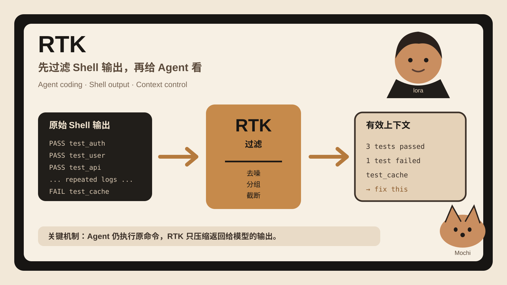

## 30 秒看懂
Coding Agent 执行 `git status`、`pytest`、`cargo test` 或搜索命令时，经常会收到很长的输出。很多内容是成功日志、重复行或格式噪声。
RTK 放在 Agent 和 shell 之间。命令照常运行。RTK 只处理返回结果。例如测试输出可以只保留失败项，Git 状态可以改成紧凑格式，搜索结果可以按文件分组。
模型看到的内容更短，但底层命令没有少跑。
最重要的边界是：项目方说的“最高 90%”是 Bash 输出压缩，不是总账单减少 90%。
## 为什么有意思
很多 Coding Agent 优化都在模型、提示词或上下文压缩上做文章。RTK 选的是更具体的入口：工具结果进入模型之前的最后一层。
这层很适合工程化。你不需要让 Agent 学会“少看一点日志”。hook 可以直接改写 shell 调用。每种命令再使用不同过滤器。失败信息、退出码和 stderr 仍然要保留。
今天的提交正好说明这个难点。项目修复了 stdout-only 过滤器吞掉 stderr 的问题。压缩输出不能以丢错误为代价。
## 3 个值得借鉴的设计
### 1. 把过滤放在工具边界
Agent 不需要每次主动调用 `rtk`。hook 或插件可以在 shell 命令执行前完成改写。规则放在 runtime 层，比写进提示词稳定。
### 2. 按命令类型过滤
`git status`、测试、lint、搜索的有效信息不同。RTK 不使用一个通用摘要器。它给不同命令定义不同结构。这能避免模型摘要把错误细节删掉。
### 3. 把测量口径写清楚
README 明确写出百分比只对应 Bash output，绝对 Token 数只是 `bytes / 4` 的估算。这个做法适合所有 Agent 优化工具。先定义测量对象，再谈收益。
## 与我的连接
你做 Agent runtime、tool calling 和 eval 时，可以直接借这个边界。
第一，工具输出先进入一个确定性的 output adapter。它负责去重、截断、分组和字段化。
第二，错误信息设置不可丢字段。退出码、stderr、失败测试名和关键堆栈要有保留策略。
第三，eval 不只测任务成功率。还可以记录每类工具的原始字节数、进入模型的字节数、错误保留率、额外延迟和最终任务成功率。
这样能区分“上下文变短”和“任务真的更好”是不是同时成立。
