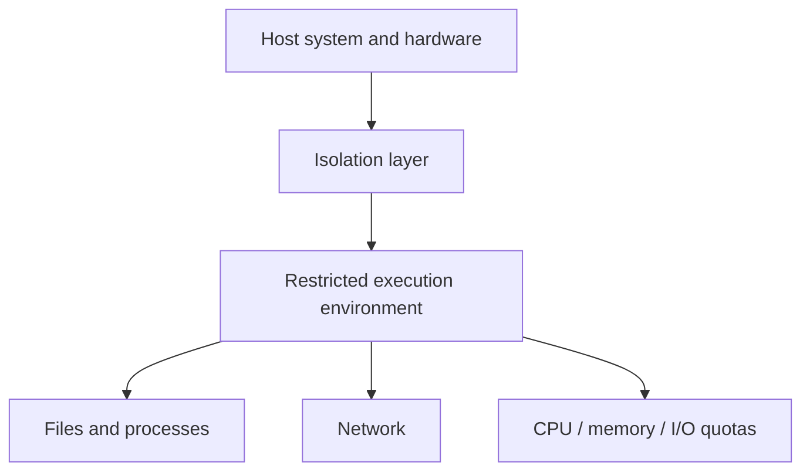

## 1. Core sandbox concepts

A **sandbox** is a restricted execution environment. It uses process, filesystem, network, permission, and resource policies to reduce the scope of what untrusted code can affect.

<Callout tone="warning" title="Isolation does not mean absolute security">
A sandbox's strength depends on its isolation mechanisms, host kernel, mounts, network policies, permissions, and patch status. Every approach must be configured for its threat model. Running inside a sandbox does not guarantee that escape is impossible.
</Callout>

### 1.1 What a sandbox is

More precisely, a program still runs in a computing environment, but the system exposes only permitted resources. Different sandboxes have different boundaries. Containers usually share the host kernel. Virtual machines provide more independent virtual hardware and a guest OS. User-space kernels add a system-call implementation layer between the application and the host kernel.

A sandbox's core value lies in:

- **Security isolation**: preventing untrusted code from affecting the host system

- **Behavior monitoring**: recording all of a program's operations in full

- **Resource limits**: preventing malicious programs from exhausting system resources

- **Environment restoration**: quickly returning to a clean state after execution

### 1.2 Overall sandbox architecture


One common abstraction has three layers:



## 2. Core sandbox principles

### 2.1 How it works


A complete sandbox workflow:

1. **Program input**: the program to analyze or execute enters the sandbox system

2. **Isolated environment**: the program is placed in an isolated execution environment

3. **Boundary control**: depending on the implementation, restrict or observe system calls and access to files, processes, networks, and resources

4. **Behavior recording**: record key system calls, file operations, process activity, and network behavior according to the implementation's capabilities

5. **Logging**: generate complete behavioral logs

6. **Security analysis**: assess security based on the behavioral data

### 2.2 Core technical principles

### Resource isolation

The sandbox allocates separate virtual resources to the program:

- **Memory space**: a separate address space to prevent out-of-bounds access

- **Filesystem**: a virtual filesystem whose changes are visible only inside the sandbox

- **Network interface**: a virtual network that can restrict or monitor network access

- **Registry**: a virtual registry, specific to Windows systems

### Permission control

Strict permission policies constrain program behavior:

- Prohibit access to sensitive system files

- Restrict process creation and injection

- Control the scope of network access

- Prohibit system-configuration changes

### Behavior monitoring

How behavior is observed depends on the platform. Auditing, system-call filtering, kernel events, or API-level observation can record key behavior. Not all sandboxes rely on hooks, and complete recording of every system call cannot be assumed:

- File reads and writes

- Registry changes

- Network-connection establishment

- Process and thread creation

- System API calls

## 3. Sandbox implementations

### 3.1 Comparing common approaches


| Technical approach | Isolation strength | Performance overhead | Startup speed | Memory overhead | Representative products |
| ------------------ | ------------------ | -------------------- | ------------- | --------------- | ----------------------- |
| Technical approach | Isolation boundary | Typical startup and resource overhead | Representative implementations |
| --- | --- | --- | --- |
| **Virtual machine, VM** | Separate guest OS and virtual-hardware boundary, usually stronger | Higher | Firecracker, VMware, Hyper-V |
| **Container** | Process and resource isolation, usually sharing the host kernel | Lower | Docker, LXC |
| **User-space kernel** | Adds a system-call implementation layer between the application and host kernel | Moderate | gVisor |
| **System-call filtering** | Restricts permitted system calls, usually combined with other isolation methods | Very low | seccomp |

### 3.2 Technical details of each approach

### 1\. Virtual machines

**Principle**: a hypervisor simulates a complete hardware environment and runs an independent guest OS

**Core technology**: hardware-assisted virtualization, Intel VT\-x and AMD\-V

**Characteristics**: the isolation boundary is usually stronger than that of shared-kernel containers, but still requires least privilege, patches, and host-side protection.

**Cost**: resource overhead and startup costs are usually higher than for containers.

### 2\. Containers

**Principle**: process-level isolation using Linux namespaces and cgroups

**Core technologies**:

- PID namespace for process isolation

- NET namespace for network isolation

- MOUNT namespace for filesystem isolation

- Cgroups for resource limits

### 3\. User-space kernels

**Principle**: implement a small kernel, Sentry, in user space to intercept all system calls

**Example**: Google gVisor

**Characteristics**: makes a different trade-off between compatibility, performance, and isolation strength than ordinary containers.

### 4\. System-call interception

**Principle**: use API hooks or seccomp to filter dangerous system calls

**Examples**: Sandboxie, Windows Sandbox

**Advantages**: lightweight, fast, and convenient for users

## 4. Building a sandbox

### 4.1 Sandbox setup workflow


### 4.2 A simple Docker-based sandbox

### Step 1: create a Dockerfile

```dockerfile
FROM python:3.11-slim

# Create an unprivileged user
RUN groupadd -r sandbox && useradd -r -g sandbox sandboxuser

# Set the working directory
WORKDIR /sandbox

# Copy the execution script
COPY run.sh .
RUN chmod +x run.sh

# Switch to the unprivileged user
USER sandboxuser

# Entry command
CMD ["./run.sh"]

```

## Step 2: write the run\.sh execution script
### Step 2: write the run\.sh execution script

```bash
#!/bin/bash
set -e

# Resource limits
ulimit -n 1024      # File descriptor limit
ulimit -u 64        # Process count limit
ulimit -f 10240     # File size limit

# Execute user code
python3 user_code.py

```

## Step 3: build and run
### Step 3: build and run

```bash
# Build the image
docker build -t python-sandbox .

# Run the sandbox with automatic cleanup
docker run --rm \
  --memory=512m \
  --cpus=0.5 \
  --pids-limit=64 \
  --network=none \
  -v $(pwd)/user_code.py:/sandbox/user_code.py:ro \
  python-sandbox

```

### 4.3 A native sandbox based on Linux namespaces

```c
#define _GNU_SOURCE
#include &lt;sched.h&gt;
#include &lt;stdio.h&gt;
#include &lt;stdlib.h&gt;
#include &lt;sys/wait.h&gt;
#include &lt;unistd.h&gt;

#define STACK_SIZE (1024 * 1024)
static char child_stack[STACK_SIZE];

static int child_func(void *arg) {
    printf("Sandbox: PID = %d\n", getpid());
    // Execute the program in the isolated environment
    execl("/bin/bash", "/bin/bash", NULL);
    return 0;
}

int main(int argc, char *argv[]) {
    // Create isolated namespaces
    int flags = CLONE_NEWUTS | CLONE_NEWIPC | CLONE_NEWPID |
                CLONE_NEWNS | CLONE_NEWNET | CLONE_NEWUSER;

    pid_t child_pid = clone(child_func, child_stack + STACK_SIZE,
                            flags | SIGCHLD, NULL);

    waitpid(child_pid, NULL, 0);
    return 0;
}

```

## 5. Sandbox use cases

### 5.1 Cybersecurity

**Malware analysis** is the classic sandbox use case

- **Virus and Trojan analysis**: run malware in isolation and observe its behavior

- **Ransomware research**: analyze encryption algorithms and propagation mechanisms

- **APT attack tracing**: reconstruct the complete attack chain

- **Dynamic antivirus detection**: products such as 360 and Kaspersky include built-in sandboxes

### 5.2 Software development and testing

- **Safe code execution**: run and verify AI-agent-generated code inside a sandbox

- **Compatibility testing**: simulate different environments to test software

- **CI/CD pipelines**: isolated build and test environments

- **Vulnerability reproduction**: security researchers verify proofs of concept

### 5.3 Safe AI agent execution

AI agents also often use sandboxes as execution boundaries when running model-generated code.

- **Code interpreters**: code-execution environments in ChatGPT and Claude

- **Tool-call safety**: prevent agents from performing dangerous operations

- **Multi-agent collaboration**: isolate each agent in its own sandbox

- **Data processing**: safely process files uploaded by users

### 5.4 Browser security

- **Chrome Site Isolation**: a separate process for each site

- **Webpage sandboxes**: isolate JavaScript execution environments

- **Downloaded-file scanning**: automatically open suspicious files in a sandbox

### 5.5 Other scenarios

- **Education and training**: student lab environments that prevent accidental damage

- **Privacy-preserving computation**: allow data to be used without exposing it

- **Game anti-cheat**: detect changes to game memory

- **Sandboxed browsers**: isolate access to suspicious websites

## 6. Common implementations and tools

Different tools solve different problems. They cannot be arranged on a single scale of isolation strength.

| Type | Examples | Better suited to | Main boundary |
| --- | --- | --- | --- |
| Malware analysis | Analysis systems such as Cuckoo Sandbox | Collecting process, file, network, and behavioral evidence | The analysis environment itself still needs ongoing updates and isolation |
| Desktop application isolation | Windows Sandbox, Sandboxie-Plus | Temporarily running untrusted applications or checking compatibility | Does not equal a malware research environment or replace host patching |
| Container isolation | Docker with namespaces, cgroups, and seccomp | CI, development tasks, and controlled code execution | Containers share the host kernel; a container boundary is not equivalent to a VM boundary |
| User-space kernel | gVisor | Adding an isolation layer between the container interface and host kernel | Compatibility and performance must be tested for the workload |
| Lightweight VM | Kata Containers, microVM approaches | Multi-tenant execution requiring an independent kernel boundary | Startup, image, and resource costs are usually higher than for ordinary containers |
| Cloud agent sandbox | Hosted execution environments such as E2B | Giving agents a temporary filesystem and facilities to run processes and network operations | Credentials, network allowlists, and write-action approvals still require separate design |

This article leaves out promotional descriptions such as "industrial-grade," "almost no performance impact," or "thousands of concurrent instances" when no current test conditions support them. When choosing a tool, check official documentation, isolation boundaries, network policies, image sources, credential handling, and teardown semantics.

## 7. Security boundaries and escapes

No sandbox is absolutely secure. Main risks include host-kernel vulnerabilities, runtime misconfiguration, overly broad mount or device permissions, accessible credentials, open network access, side channels, and hardware vulnerabilities.

### What to check first when hardening

- Use least privilege. Do not grant root, host sockets, devices, or broad capabilities by default.
- Restrict networking by default and allow only destinations the task actually needs.
- Keep credentials outside the execution environment where possible. Provide least-privilege access through short-lived credentials or an outbound proxy.
- Mount files read-only or expose only the smallest necessary directory, and give temporary directories independent lifecycles.
- Limit CPU, memory, process count, file size, and running time.
- Preserve key audit records, but never write raw secret values into logs.
- Keep the host kernel, runtime, and base images updated.

<Callout tone="warning" title="The boundary most often confused">
A sandbox determines where code runs and what it can access. It does not automatically prevent exposure of third-party API credentials or make write operations safe.
</Callout>

## 8. A minimal test for an agent project

Start with a task that can access only test data. Run it both as an ordinary process and inside a restricted sandbox. Record file access, network destinations, process counts, resource limits, and logs. Then deliberately try to access unmounted directories, unapproved domains, and processes beyond the quota.

Acceptance depends on whether the boundaries fail as expected, not merely whether the command starts. At minimum, confirm that unauthorized files cannot be read, unapproved network destinations cannot be reached, exceeding resource limits terminates execution, temporary state is cleaned up after exit, and logs contain no raw credentials.

## References

- Official Linux namespaces, cgroups, and seccomp documentation
- Official gVisor documentation
- Docker security documentation
- Windows Sandbox documentation
- Cuckoo Sandbox project documentation
