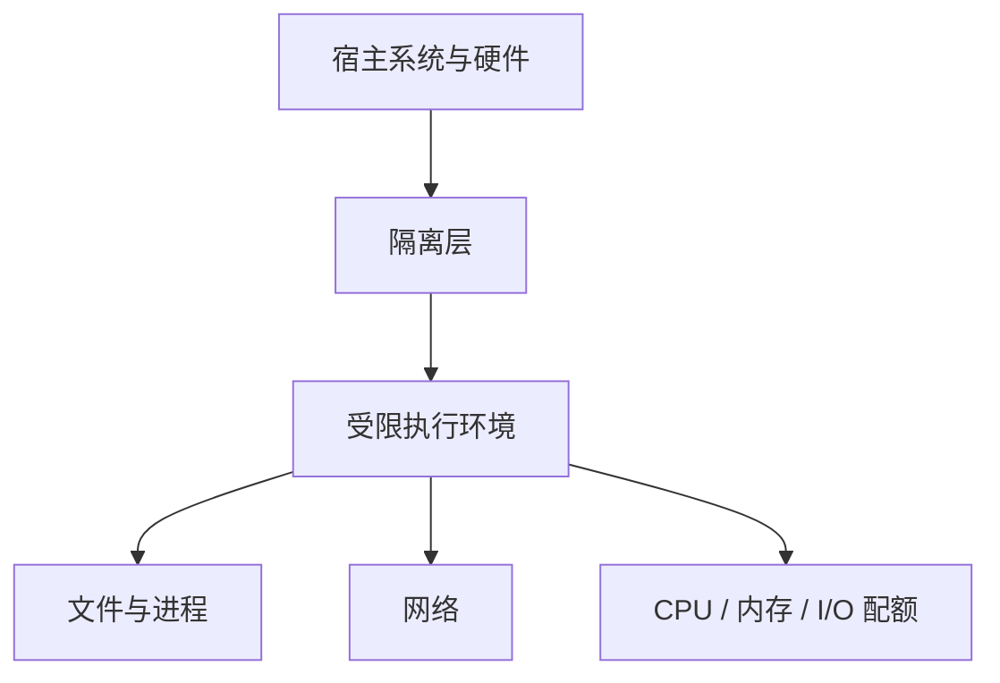

## 一、沙箱核心概念

**沙箱（Sandbox）**是一种受限执行环境。它通过进程、文件系统、网络、权限和资源策略缩小不可信代码可以影响的范围。

<Callout tone="warning" title="隔离不是绝对安全">
沙箱的强度取决于具体隔离原语、宿主内核、挂载、网络策略、权限和补丁状态。任何方案都需要按威胁模型配置，不能把“运行在沙箱里”当成绝对不会逃逸。
</Callout>

### 1.1 什么是沙箱

更准确的理解是：程序仍然运行在某种计算环境里，但系统只暴露被允许的资源。不同沙箱的边界不同。容器通常共享宿主内核，虚拟机提供更独立的虚拟硬件和 Guest OS，用户态内核则在应用与宿主内核之间增加一层系统调用实现。

沙箱的核心价值在于：

- **安全隔离**：不可信代码无法影响宿主系统

- **行为监控**：完整记录程序的所有操作行为

- **资源限制**：防止恶意程序耗尽系统资源

- **环境还原**：执行结束后可快速恢复干净状态

### 1.2 沙箱整体架构


一个常见的抽象可以画成三层：



## 二、沙箱核心原理

### 2.1 工作原理详解


沙箱的完整工作流程：

1. **程序输入**：待分析/执行的程序进入沙箱系统

2. **隔离环境**：程序被放置在隔离的执行环境中

3. **边界控制**：根据实现限制或观察系统调用、文件、进程、网络和资源访问

4. **行为记录**：按实现能力记录关键系统调用、文件、进程和网络行为

5. **日志记录**：生成完整的行为日志

6. **安全分析**：基于行为数据进行安全评估

### 2.2 核心技术原理

### 资源隔离

沙箱为程序分配独立的虚拟资源：

- **内存空间**：独立的地址空间，防止越界访问

- **文件系统**：虚拟文件系统，所有修改仅在沙箱内可见

- **网络接口**：虚拟网络，可限制或监控网络访问

- **注册表**：虚拟注册表，Windows系统专用

### 权限控制

通过严格的权限策略限制程序行为：

- 禁止访问敏感系统文件

- 限制进程创建和注入

- 控制网络访问范围

- 禁止修改系统配置

### 行为监控

行为观测的实现取决于平台。可以使用审计、系统调用过滤、内核事件或 API 级观测记录关键行为，但并不是所有沙箱都依赖 Hook，也不能默认所有系统调用都会被完整记录：

- 文件读写操作

- 注册表修改

- 网络连接建立

- 进程/线程创建

- 系统API调用

## 三、沙箱技术实现方式

### 3.1 主流实现方案对比


| 技术方案                  | 隔离强度        | 性能损耗      | 启动速度     | 内存开销   | 代表产品           |
| ------------------------- | --------------- | ------------- | ------------ | ---------- | ------------------ |
| 技术方案 | 隔离边界 | 典型启动与资源开销 | 代表实现 |
| --- | --- | --- | --- |
| **虚拟机 VM** | 独立 Guest OS 与虚拟硬件边界，通常更强 | 较高 | Firecracker、VMware、Hyper-V |
| **容器** | 进程与资源隔离，通常共享宿主内核 | 较低 | Docker、LXC |
| **用户态内核** | 在应用与宿主内核间增加系统调用实现层 | 中等 | gVisor |
| **系统调用过滤** | 限制允许的系统调用，通常与其他隔离手段组合 | 很低 | seccomp |

### 3.2 各方案技术细节

### 1\. 虚拟机方案

**原理**：通过Hypervisor模拟完整的硬件环境，运行独立的Guest OS

**核心技术**：硬件辅助虚拟化（Intel VT\-x, AMD\-V）

**特点**：隔离边界通常比共享内核容器更强，但仍需要最小权限、补丁和宿主侧防护。

**代价**：资源开销和启动成本通常高于容器。

### 2\. 容器方案

**原理**：基于Linux Namespace和Cgroups实现进程级隔离

**核心技术**：

- PID Namespace \- 进程隔离

- NET Namespace \- 网络隔离

- MOUNT Namespace \- 文件系统隔离

- Cgroups \- 资源限制

### 3\. 用户态内核方案

**原理**：在用户空间实现一个迷你内核（Sentry），拦截所有系统调用

**代表**：Google gVisor

**特点**：在兼容性、性能与隔离强度之间做不同于普通容器的权衡。

### 4\. 系统调用拦截方案

**原理**：通过API Hook或seccomp过滤危险系统调用

**代表**：Sandboxie, Windows Sandbox

**优势**：轻量快速，用户体验好

## 四、沙箱制作方法

### 4.1 沙箱搭建流程


### 4.2 基于Docker的简易沙箱制作

### 步骤1：创建Dockerfile

```dockerfile
FROM python:3.11-slim

# 创建非特权用户
RUN groupadd -r sandbox && useradd -r -g sandbox sandboxuser

# 设置工作目录
WORKDIR /sandbox

# 复制执行脚本
COPY run.sh .
RUN chmod +x run.sh

# 切换到非特权用户
USER sandboxuser

# 入口命令
CMD ["./run.sh"]

```

## 步骤2：编写执行脚本run\.sh
### 步骤2：编写执行脚本run\.sh

```bash
#!/bin/bash
set -e

# 资源限制
ulimit -n 1024      # 文件描述符限制
ulimit -u 64        # 进程数限制
ulimit -f 10240     # 文件大小限制

# 执行用户代码
python3 user_code.py

```

## 步骤3：构建并运行
### 步骤3：构建并运行

```bash
# 构建镜像
docker build -t python-sandbox .

# 运行沙箱（自动清理）
docker run --rm \
  --memory=512m \
  --cpus=0.5 \
  --pids-limit=64 \
  --network=none \
  -v $(pwd)/user_code.py:/sandbox/user_code.py:ro \
  python-sandbox

```

### 4.3 基于Linux Namespace的原生沙箱

```c
#define _GNU_SOURCE
#include &lt;sched.h&gt;
#include &lt;stdio.h&gt;
#include &lt;stdlib.h&gt;
#include &lt;sys/wait.h&gt;
#include &lt;unistd.h&gt;

#define STACK_SIZE (1024 * 1024)
static char child_stack[STACK_SIZE];

static int child_func(void *arg) {
    printf("Sandbox: PID = %d\n", getpid());
    // 在隔离环境中执行程序
    execl("/bin/bash", "/bin/bash", NULL);
    return 0;
}

int main(int argc, char *argv[]) {
    // 创建隔离命名空间
    int flags = CLONE_NEWUTS | CLONE_NEWIPC | CLONE_NEWPID |
                CLONE_NEWNS | CLONE_NEWNET | CLONE_NEWUSER;

    pid_t child_pid = clone(child_func, child_stack + STACK_SIZE,
                            flags | SIGCHLD, NULL);

    waitpid(child_pid, NULL, 0);
    return 0;
}

```

## 五、沙箱使用场景

### 5.1 网络安全领域

**恶意代码分析**是沙箱最经典的应用场景

- **病毒/木马分析**：在隔离环境中运行恶意软件，观察其行为

- **勒索软件研究**：分析加密算法和传播机制

- **APT攻击溯源**：还原完整攻击链

- **杀毒软件动态检测**：360、卡巴斯基等均内置沙箱

### 5.2 软件开发与测试

- **代码安全执行**：AI Agent生成的代码在沙箱中运行验证

- **兼容性测试**：模拟不同环境测试软件

- **CI/CD流水线**：隔离的构建和测试环境

- **漏洞复现**：安全研究人员验证PoC

### 5.3 AI Agent安全执行

AI Agent 运行模型生成代码时，也常把沙箱作为执行边界。

- **代码解释器**：ChatGPT、Claude的代码执行环境

- **工具调用安全**：防止Agent执行危险操作

- **多Agent协作**：每个Agent独立沙箱隔离

- **数据处理**：用户上传文件的安全处理

### 5.4 浏览器安全

- **Chrome Site Isolation**：每个站点独立进程

- **网页沙箱**：JavaScript执行环境隔离

- **下载文件扫描**：自动在沙箱中打开可疑文件

### 5.5 其他场景

- **教育实训**：学生实验环境，防止误操作

- **隐私计算**：数据可用不可见

- **游戏反作弊**：检测游戏内存修改

- **沙箱浏览器**：隔离访问可疑网站

## 六、常见实现与工具

不同工具解决的问题不同，不能只按“隔离强弱”排成一条线。

| 类型 | 例子 | 更适合做什么 | 主要边界 |
| --- | --- | --- | --- |
| 恶意代码分析 | Cuckoo Sandbox 等分析系统 | 收集进程、文件、网络和行为证据 | 分析环境本身仍需要持续更新与隔离 |
| 桌面应用隔离 | Windows Sandbox、Sandboxie-Plus | 临时运行不信任应用或做兼容性检查 | 不等于恶意软件研究环境，也不替代主机补丁 |
| 容器隔离 | Docker 加 namespaces、cgroups、seccomp | CI、开发任务和受控代码执行 | 容器共享宿主内核，不能把容器边界等同于 VM 边界 |
| 用户态内核 | gVisor | 在容器接口和宿主内核之间增加隔离层 | 兼容性和性能要按工作负载验证 |
| 轻量 VM | Kata Containers、microVM 方案 | 需要独立内核边界的多租户执行 | 启动、镜像和资源成本通常高于普通容器 |
| Agent 云沙箱 | E2B 等托管执行环境 | 给 Agent 提供临时文件系统、进程和网络执行面 | 仍要单独设计凭据、网络 allowlist 和写操作审批 |

这里不保留“工业级”“几乎无性能影响”“千级并发”这类没有当前测试条件的宣传描述。选型时应核对官方文档、隔离边界、网络策略、镜像来源、凭据处理和销毁语义。

## 七、安全边界和逃逸

没有绝对安全的沙箱。风险主要来自宿主内核漏洞、运行时配置错误、过宽的挂载或设备权限、可访问的凭据、开放网络，以及侧信道和硬件漏洞。

### 加固时先检查什么

- 使用最小权限。不要默认给 root、宿主 socket、设备或宽泛 capability。
- 网络默认收紧，只开放任务确实需要的目标。
- 凭据尽量留在执行环境外，通过短期凭据或出站代理提供最小权限。
- 文件挂载使用只读或最小目录，并给临时目录设置独立生命周期。
- 给 CPU、内存、进程数、文件大小和运行时间设置限制。
- 保存关键审计记录，但不要把 secret 原值写入日志。
- 及时更新宿主内核、运行时和基础镜像。

<Callout tone="warning" title="最容易混淆的边界">
沙箱解决的是代码在哪里运行、能访问什么。它不会自动解决第三方 API 凭据是否暴露，也不会自动让写操作变得安全。
</Callout>

## 八、给 Agent 项目做最小验证

先准备一个只能访问测试数据的任务。分别运行普通进程和受限沙箱，记录文件访问、网络目标、进程数量、资源限制和日志。再故意尝试访问未挂载目录、未批准域名和超出配额的进程。

验收不看“命令能不能启动”，而看边界是否按预期失败。至少确认未授权文件不可读、未批准网络不可达、资源超限会终止、退出后临时状态被清理，而且日志中没有原始凭据。

## 参考资料

- Linux namespaces、cgroups 和 seccomp 官方文档
- gVisor 官方文档
- Docker 安全文档
- Windows Sandbox 文档
- Cuckoo Sandbox 项目文档
