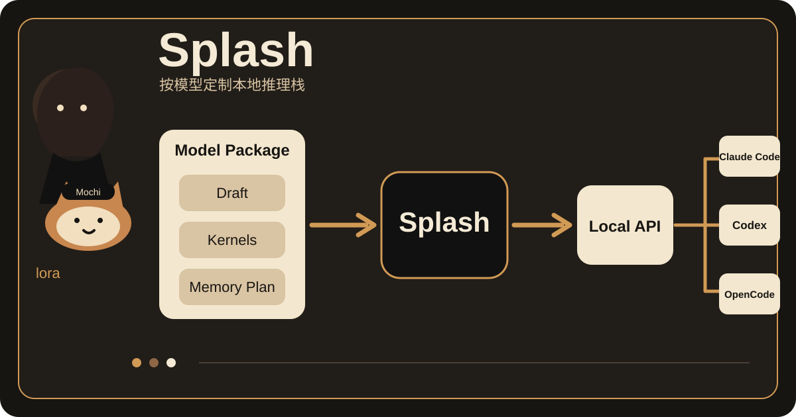

# 事实核验
- 项目名称：Splash。
- 组织：IncoAI，GitHub 组织为 `incoai`。
- 官方仓库：[incoai/splash](https://github.com/incoai/splash)。
- 官方文章：[Splash launch post](https://inco.ai/blog/splash/)。
- 核心功能：在 Apple silicon 上本地运行少量经过专门适配的模型，并提供 OpenAI Chat Completions、OpenAI Responses 和 Anthropic Messages 兼容接口。
- Coding Agent 接入：README 提供 `splash claude`、`splash codex`、`splash opencode` 和 `splash hermes` 启动方式。
- 当前模型包：README 列出 `Qwen3.8-27B-Splash` 和 `Qwen3.6-35B-A3B-Splash`。
- 关键设计：每个模型包带自己的 speculative decoding draft、按模型尺寸编译的 Metal kernels，以及按当前机器计算的内存计划。
- 硬件要求：Apple M3 或更新芯片，macOS 26.4 或更新版本，至少 36 GB 统一内存，官方建议 48 GB 或更多。
- Demo：启动服务后可打开本机 `127.0.0.1:8000` 的 Web UI，也可从另一个终端直接启动已安装的 Coding Agent。
- LICENSE：Apache 2.0。
- 当前状态：GitHub 仓库公开且未归档。Splash 1.0 于 2026-09-18 发布。2026-09-18 本次抓取时当天仍有新的 `Splash 1.0` 提交。
# 证据卡
1. [官方 README](https://github.com/incoai/splash#readme) 说明安装条件、支持的模型包、兼容 API、Coding Agent 启动方式和三项模型专用优化。
2. [Splash 1.0 Release](https://github.com/incoai/splash/releases/tag/1.0) 给出正式安装包、系统要求和 1.0 能力清单。
3. [Apache 2.0 LICENSE](https://github.com/incoai/splash/blob/main/LICENSE) 可核验代码许可证。
4. [Splash 1.0 commit](https://github.com/incoai/splash/commit/f58d36ddb046726adc8937ab67d07bdde015c0d6) 可核验本次抓取时的最新提交。
# 30 秒看懂
Splash 是一个只跑在 Apple silicon 上的本地 LLM 推理引擎。
它没有把“支持更多模型”放在第一位。每个 Splash 模型包都带专用 draft model、Metal kernels 和内存计划。运行时再通过 OpenAI 和 Anthropic 兼容接口，把本地模型接给 Claude Code、Codex、OpenCode 等工具。
它的取舍很明确。支持面更窄，但可以针对具体模型和 Mac 硬件做更深的推理优化。
# 为什么有意思
多数本地推理工具先做一个通用 runtime，再适配尽可能多的模型。Splash 走了相反路线。
它把模型当作一个完整运行包。draft model、权重布局、Metal kernels 和内存预算都可以跟着模型一起设计。这样做会牺牲模型覆盖范围，但工程团队可以把性能优化放到更具体的形状、缓存和调度问题上。
对 Coding Agent 场景，这个设计还有一个实际好处。上层工具继续使用熟悉的 OpenAI 或 Anthropic API，底层是否在云端不需要改变 Agent 的调用结构。
# 3 个值得借鉴的设计
## 1. 模型包包含运行策略
Splash 的模型包不是只有权重。它还包含对应的 draft model，并要求 runtime 按模型尺寸使用专门的 Metal kernels。模型和推理策略一起交付。
## 2. 启动时再算机器预算
Splash 启动时根据当前机器可用的 Metal 内存，扣除权重、draft 和请求状态后，再决定 context、KV capacity 和 batch 上限。配置来自实际机器，不靠一套固定默认值。
## 3. 推理后端和 Agent 接口分开
Splash 对外提供 OpenAI 和 Anthropic 兼容接口。Claude Code、Codex、OpenCode 等客户端不需要理解底层 Metal kernels。这样可以单独替换推理后端，而不改 Agent 上层流程。
# 与我的连接
你现在经常同时用 Codex、Claude Code 和其他 Coding Agent。Splash 值得参考的不是“本地模型更便宜”，而是它把本地推理做成了一个兼容后端。
如果以后给自己的 Agent Harness 加本地模型，可以保留现有 OpenAI 或 Anthropic 接口层，把模型运行、缓存和硬件优化放到独立 runtime。这样上层 Agent 不需要跟着推理引擎一起改。
它当前的硬件门槛也很明确。统一内存低于 36 GB 的 Mac 不能直接按官方要求运行，所以它不是轻量本地部署方案。
