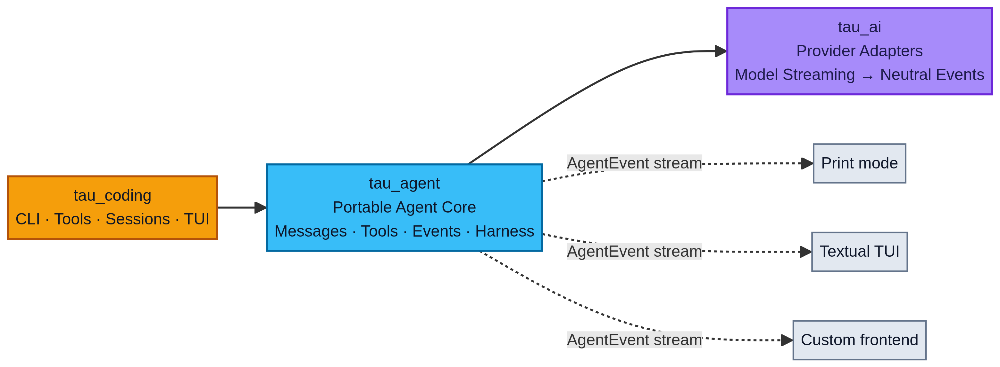

When changing a coding agent's model or adding a web interface, dependencies between modules are often the first problem. The core loop writes terminal output directly, tools read interface state, and the frontend parses raw model-provider responses. Changing one feature then requires changes across several modules.

Tau separates model adaptation, the agent core, and the application. The application uses the core, and the core uses the model-adaptation layer. The core does not depend back on the interface. That lets you change interfaces while keeping the existing message and tool-processing logic. [1]

## What each of the three layers does



Tau's three-layer architecture. The original diagram already uses English labels. The application depends on the portable agent core, the core calls provider adapters, and the core's AgentEvent stream feeds separate interface consumers.

<MediaVideo
  src="/media/blog/tau-agent-architecture/tau-architecture-site-recreation.mp4"
  title="Tau three-layer dependencies and event flow"
  caption="Three-layer architecture animation showing dependencies between the application, agent core, and model-adaptation layer, then neutral events reaching Print, TUI, and Custom UI. The retained five-second video uses English labels and has no audio or subtitle track."
/>

<OptionTabs
  title="Explore the three layers"
  items="tau_ai::Model-adaptation layer::Calls model providers and converts streamed responses into shared events;;Does not depend on a particular interface or coding workflow|tau_agent::Agent core::Organizes messages, tools, events, loop control, and basic session capabilities;;Does not depend on the command-line interface, Textual, Rich, or application resource loading|tau_coding::Application layer::Provides the coding assistant's command line, tools, project instructions, skills, disk sessions, and terminal interface;;Consumes core events without exposing raw provider protocols further to the interface"
  source="Based on Tau architecture documentation and design principles [1][3]"
/>

The dependency order is `tau_coding` using `tau_agent`, which uses `tau_ai`. Both terminal and web interfaces can consume events emitted by the core. [1]

`tau_ai` handles format differences between model providers. Providers may use different structures for text deltas, tool calls, and completion states, for example. The adaptation layer converts these differences into a shared event structure so higher layers do not have to parse each provider's responses separately.

`tau_agent` handles state changes within a run. It prepares context, receives model requests, executes tools, and records results. It does not need to know which button a user clicked, and it does not decide which application directory should store disk sessions.

`tau_coding` combines these capabilities into a coding assistant. This layer organizes application-specific behavior: how project instructions are loaded, how tools are configured, how sessions are stored on disk, and how users cancel runs. [1][3]

## The core emits events; the interface displays them

Suppose an agent needs to read a file and show the user its findings. The core can emit message-update, tool-start, and tool-end events. A terminal prints text when it receives those events; a webpage updates components.

If the core instead calls terminal components directly, the web application cannot reuse it independently. Tests must also create an interface just to verify logic that concerns only messages and tools.

The following is teaching pseudocode, not Tau source code. It illustrates the separation of event production from rendering, not a complete agent loop.

```python
from typing import AsyncIterator, Protocol


class ModelEvents(Protocol):
    def stream(self, messages: list[dict]) -> AsyncIterator[dict]: ...


class AgentCore:
    def __init__(self, model: ModelEvents, tools: dict):
        self.model = model
        self.tools = tools

    async def run_turn(self, messages: list[dict]):
        async for event in self.model.stream(messages):
            yield event
            if event["type"] == "tool_call":
                result = await self.tools[event["name"]](**event["args"])
                messages.append({"role": "tool", "content": result})


async def render_terminal(events):
    async for event in events:
        print(event)
```

This example does not call the model again after a tool completes, nor does it fully save the assistant's tool-call messages and their identifiers. It also omits argument validation, exception handling, cancellation, and loop limits. A real application cannot use this snippet directly as a complete runner.

The point to observe is where the dependency sits. `print` belongs to the rendering function, not `AgentCore`. Adding a web interface can mean adding an event consumer instead of putting display logic into the core.

## Patterns that break the separation

### The core directly writes terminal output

Terminal rendering inside the core creates unwanted output for web interfaces, tests, and batch processing. The core should report what happened and leave consumers to decide how to display it. [2]

### Tools read temporary interface state

A file-editing tool that directly reads the currently selected line in a particular interface cannot be reused through other entry points. The application should first convert the selection into explicit tool arguments.

Tau organizes tools as typed functions with a name, description, input schema, and asynchronous executor. Interface state should not become a hidden tool input. [3]

### The frontend parses raw provider chunks

Once a frontend directly parses a particular provider's responses, that protocol affects the interface code. Adding a second provider often requires another set of branches. Keeping conversion in the model-adaptation layer lets the frontend continue handling shared events. [1][2]

### Adding layers for requirements that do not exist

Layers should correspond to separate responsibilities. Model adaptation, loop control, and the interface change for different reasons, so separating them is useful. A directory with no independent responsibility does not need another layer just for form's sake.

## Responsibilities in a code-review agent

Consider a concrete requirement. A user submits a Git diff. The agent reads related files, runs checks, and displays its findings in the terminal. A web entry point will be needed later.

The model-adaptation layer handles model calls and response conversion. The agent core handles messages, tool requests, and run events. The review application supplies a diff-reading tool, project rules, and session storage. The terminal and web interfaces display the same run events separately.

The diff-reading tool therefore does not need to know whether the current interface is a webpage or a terminal. The webpage also does not need to parse the provider's tool-call chunks.

The following operations can help check whether responsibilities are clear.

| Operation | Appropriate location |
| --- | --- |
| Convert provider tool-call chunks into shared events. | Model-adaptation layer. |
| Write tool results back into conversation history and continue calling the model. | Agent core. |
| Respond to the cancellation key and call the session's cancellation interface. | Application or frontend layer. |
| Display run progress as a terminal progress bar. | Frontend layer. |

## Check your own project

Open the file containing the core loop. Check whether it imports web or terminal components, directly reads application-specific directories, or directly prints raw provider chunks.

Start by replacing one rendering operation with an emitted event, then write two consumers. One collects events into a list; the other prints them.

```python
async def collect_events(events):
    return [event async for event in events]


async def print_events(events):
    async for event in events:
        print(event)
```

In tests, give each consumer a fresh event stream. Do not make them read the same already-exhausted generator in sequence.

If both consumers work without depending on the core's internal implementation, that piece of display logic can now be replaced independently. Next, check tool inputs and provider protocols. There is no need to rewrite the whole project at once.

## References

[1] [Tau architecture documentation](https://twotimespi.dev/internals/architecture/).

[2] [Tau Agent Loop and events](https://twotimespi.dev/internals/agent-loop/).

[3] [Tau design principles](https://twotimespi.dev/internals/design-principles/).
