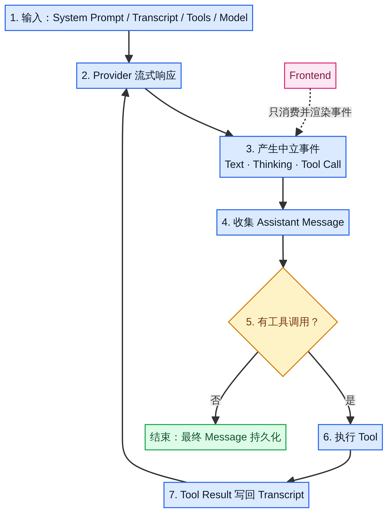

An agent that can call tools may need several model requests to complete a task. The model first asks to read a file. The program executes the tool and records the result, then the model decides what to do next based on the file's contents.

The agent loop coordinates this process. The frontend should receive explicit message, tool, and session events so it does not have to guess the running state from the text. [1]

## How a run continues

The program first prepares the system prompt, conversation history, available tools, and model configuration, then sends a request to the model. As the model returns content, the program emits events while also collecting the complete assistant message.

If the assistant message contains tool calls, the program executes the tools, adds the assistant's call requests and the tool results to the conversation history, and calls the model again. If there are no more tool calls, this iteration of the loop ends. [1]



Original Chinese-language diagram of the agent event loop. The sequence is input → streamed provider response → events → a complete assistant message → a tool-call check. Requested tools run and return their results to the conversation history before the next model request; otherwise, the final message is saved. The frontend only consumes and renders events.

| Stage | What the program handles |
| ----- | ------------------------ |
| Prepare the input. | The system prompt, existing messages, tool definitions, and model configuration. |
| Call the model. | Receive the streamed response, emit progress events, and collect the assistant message. |
| Execute tools. | Run the tools requested by the model and add the calls and results to the conversation history. |
| Decide whether to continue. | Call the model again if there are tool results to process; otherwise, end this iteration of the loop. |

Tool results must become part of the context for the next model request. Displaying the results on a page or writing them to a log does not give the model access to that information.

## Handle streamed deltas and final messages separately

Streamed deltas let the frontend display new content immediately. The final assistant message is used to save and restore sessions and construct the next request. Neither kind of data can replace the other. [1]

<ComparePanel
  title="Two message responsibilities within the same run"
  leftTitle="Streamed deltas"
  left="Update the page's text and state as soon as possible|Let users see progress during the run|Cannot serve as the sole basis for session recovery"
  rightTitle="Final messages"
  right="Save the complete assistant output and tool-call information|Restore sessions and construct the next model request|Do not need to replace the frontend's live incremental display"
  source="Based on the roles of MessageUpdateEvent and MessageEndEvent in the Tau Agent Loop documentation"
/>

For example, seeing a passage of text on the page does not mean the complete tool-call record has been saved. Session recovery should read the final messages rather than reconstructing them from every text fragment the page has displayed.

Tau's reusable core provides events such as `MessageUpdateEvent` and `MessageEndEvent`. Message update events contain specific streamed changes, while message end events contain the final assistant message. The tool lifecycle uses `ToolExecutionStartEvent`, `ToolExecutionUpdateEvent`, and `ToolExecutionEndEvent`. [1]

The `message_delta`, `tool_start`, and `tool_end` names in the teaching example below are simplified custom names, not Tau's actual type names.

## How the frontend consumes events

Tau's custom frontend guide uses `CodingSession` to organize the coding assistant environment. The frontend passes input to the session, then handles events in sequence. [2]

```python
async for event in session.prompt(user_text):
    render_event(event)
```

This snippet shows how to use the interface. It assumes the program has already created `session` and implemented `render_event`; it cannot run on its own.

The frontend handles input, message display, tool status, and user actions. The session environment organizes model calls, conversation history, tool configuration, and execution control. The frontend does not need to parse provider responses directly and should not depend on the terminal interface's internal implementation.

## agent_end alone does not mean the session is idle

Tau's session layer may continue compacting context, retrying, or handling queued input after one agent turn ends. The frontend therefore cannot mark the entire session as idle merely because it received `agent_end`.

Tau's custom frontend guide requires the frontend to use `agent_settled` to leave the running state. This event comes from the session layer and should not be confused with the reusable core's event for the end of a single turn. [2]

| State change | What the frontend should do |
| ------------ | --------------------------- |
| A run starts. | Show the running state and provide a way to cancel or queue input. |
| A message updates. | Update the displayed content without replacing final-message storage. |
| A tool starts or finishes. | Show the actual execution state and result; do not show success in advance. |
| The session emits `agent_settled`. | Leave the running state and update the queue display. |

## New input and cancellation during a run

Starting another `prompt` without specifying its behavior while the same session is running risks concurrent changes to the conversation history. Tau rejects these overlapping calls and provides explicit ways to handle new input. [2]

Use `streaming_behavior="steer"` to guide the current run. Use `streaming_behavior="follow_up"` to process the input after the current run stops naturally. The frontend should choose these behaviors explicitly rather than treating the requests as independent.

Cancellation must do more than hide the loading indicator. Tau's frontend guide requires calling `session.cancel()` and continuing to consume events until the event stream ends. [2]

Session recovery should also use the public session and message interfaces. Parsing raw JSONL files directly makes the frontend depend on the storage format. [2][3]

## Run an event-sequence demo

The following code does not use Tau or call a real model service. It uses a tool that returns a fixed time to demonstrate message updates, tool execution, errors, and end events. It requires Python 3.10 or later and has no third-party dependencies.

This example has no conversation history, does not call the model again after the tool finishes, and does not implement queuing, cancellation, or automatic context compaction. The program assembles the final message itself, so this is an event-consumption demo rather than a complete agent loop.

Save the code as `agent_events_demo.py` and run `python agent_events_demo.py`.

```python
import asyncio
from collections.abc import AsyncIterator, Awaitable, Callable
from dataclasses import dataclass


@dataclass(frozen=True)
class Event:
    kind: str
    payload: str


async def fake_provider() -> AsyncIterator[Event]:
    yield Event("message_delta", "I'll check the time first.")
    yield Event("tool_call", "get_time")


async def get_time() -> str:
    return "10:30"  # Fixed demo data, not the current time.


async def agent_turn(
    tool: Callable[[], Awaitable[str]],
) -> AsyncIterator[Event]:
    yield Event("agent_start", "Started processing the input")
    async for event in fake_provider():
        yield event
        if event.kind == "tool_call":
            yield Event("tool_start", event.payload)
            try:
                result = await tool()
            except Exception as error:
                yield Event("tool_error", type(error).__name__)
                yield Event("agent_settled", "Stopped because the tool failed")
                return
            yield Event("tool_end", result)
            yield Event("message_delta", f"The demo result is {result}.")
    yield Event("agent_settled", "Demo finished")


async def render_console() -> None:
    async for event in agent_turn(get_time):
        print(f"{event.kind:>14} | {event.payload}")


if __name__ == "__main__":
    asyncio.run(render_console())
```

A normal run displays the start event, the first message, the tool call, the tool start, the tool end, the result message, and the end event in that order. `10:30` is fixed demo data, not the actual time.

```text
   agent_start | Started processing the input
 message_delta | I'll check the time first.
     tool_call | get_time
    tool_start | get_time
      tool_end | 10:30
 message_delta | The demo result is 10:30.
 agent_settled | Demo finished
```

To observe the error path, change `get_time` to an asynchronous function that raises `RuntimeError`. The program will emit `tool_error`, then a stop event, without displaying a successful result.

Here, `agent_settled` means the teaching simulator has stopped. In a real application, the session layer must confirm that queued work, retries, and similar tasks have been handled before emitting the event with that name. A tool returning is not enough reason to emit it.

## What to preserve when connecting a web interface

Suppose a web page accepts tasks on the left and shows file reads, command execution, and modification results on the right. The backend can run the session and send events to the page over WebSocket. The page maintains separate state for the current message, tool status, execution status, and queued input.

When a user submits another request, the interface needs to explain whether that input will guide the current run or wait for the next run. When a tool fails, the interface should display the failure rather than leaving it only in a backend log.

You can also try replacing the demo tool. First, keep the interface that takes no arguments and returns a string, then verify that the event consumer needs no changes. If you switch to a file-reading tool that requires a `path` argument, you must also add argument passing and validation; changing the function name alone is not enough.

When both the terminal consumer and the web consumer can handle the same events, display logic is separate from execution logic. A complete application also needs to verify final-message persistence, cancellation, and queuing behavior. Checking that text appears on the page is not enough.

## References

[1] [Tau Agent Loop and events](https://twotimespi.dev/internals/agent-loop/).

[2] [Tau custom frontend guide](https://twotimespi.dev/internals/custom-frontend/).

[3] [Tau design principles](https://twotimespi.dev/internals/design-principles/).
