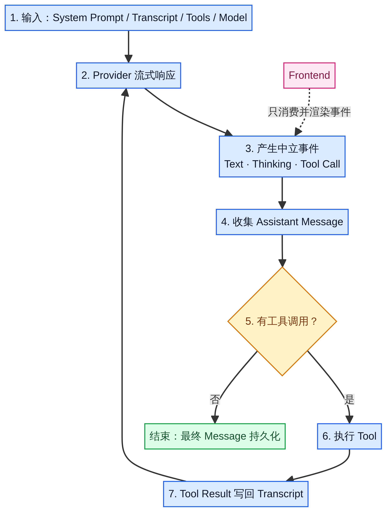

一个能调用工具的 Agent，可能需要多次请求模型才能完成一项任务。模型先请求读取文件，程序执行工具并记录结果，然后模型根据文件内容决定下一步。

Agent Loop 负责组织这个过程。前端不需要靠文字内容猜测运行状态，它应该接收明确的消息、工具和会话事件。[1]

## 一次运行如何继续

程序先准备系统提示词、对话记录、可用工具和模型配置，然后请求模型。模型返回内容时，程序向外发出事件，同时收集完整的助手消息。

如果助手消息包含工具调用，程序执行相应工具，将助手的调用请求和工具结果写入对话记录，再次请求模型。如果没有更多工具调用，这一轮循环结束。[1]



Agent 事件循环示意图。

| 阶段 | 程序处理的内容 |
| --- | --- |
| 准备输入。 | 系统提示词、已有消息、工具定义和模型配置。 |
| 请求模型。 | 接收流式响应，发出进度事件，收集助手消息。 |
| 执行工具。 | 执行模型请求的工具，将调用及结果写入对话记录。 |
| 决定是否继续。 | 有工具结果需要处理时再次请求模型，否则结束这一轮循环。 |

工具结果必须成为下一次模型请求的上下文。只把结果显示在页面或写进日志，不能让模型获得这些信息。

## 流式增量与最终消息分开处理

流式增量让前端立即显示新内容。最终助手消息用于保存、恢复会话和构造下一次请求。这两种数据不能互相替代。[1]

例如，页面已经显示了一段文本，不代表完整的工具调用记录已经保存。会话恢复应该读取最终消息，而不是把页面显示过的所有文本片段重新拼接。

Tau 的可复用核心提供 `MessageUpdateEvent` 和 `MessageEndEvent` 等事件。消息更新事件包含具体的流式变化，消息结束事件包含最终助手消息。工具生命周期使用 `ToolExecutionStartEvent`、`ToolExecutionUpdateEvent` 和 `ToolExecutionEndEvent`。[1]

下文教学代码里的 `message_delta`、`tool_start` 和 `tool_end` 是自定义简化名称，不是 Tau 实际类型名称。

## 前端如何消费事件

Tau 的自定义前端指南使用 `CodingSession` 组织编程助手环境。前端把输入交给会话，再依次处理事件。[2]

```python
async for event in session.prompt(user_text):
    render_event(event)
```

这是一段接口使用片段。它假设程序已经创建 `session`，并实现了 `render_event`，不能单独运行。

前端负责输入、消息显示、工具状态和用户操作。模型调用、会话记录、工具配置和运行控制由会话环境组织。前端不必直接解析供应商响应，也不应依赖终端界面的内部实现。

## 结束状态不能只看 agent_end

Tau 的会话层可能在一轮 Agent 结束后继续进行压缩、重试或处理排队输入。因此，前端不能仅收到 `agent_end` 就把整个会话显示为空闲。

Tau 的自定义前端指南要求用 `agent_settled` 退出运行状态。它是会话层提供的事件，不应与可复用核心的单轮结束事件混为一谈。[2]

| 状态变化 | 前端应做的事 |
| --- | --- |
| 运行开始。 | 显示运行状态，提供取消或排队入口。 |
| 消息更新。 | 更新正在显示的内容，不代替最终消息存储。 |
| 工具开始或完成。 | 显示实际运行状态和结果，不预先显示成功。 |
| 会话发出 `agent_settled`。 | 退出运行状态，更新队列显示。 |

## 运行中的新输入和取消

同一会话运行时，再启动一个未指定行为的 `prompt`，会产生对话记录的并发修改风险。Tau 拒绝这种重叠调用，并提供明确的处理方式。[2]

`streaming_behavior="steer"` 用于引导当前运行。`streaming_behavior="follow_up"` 将输入安排在当前运行自然停止后继续处理。这些行为应由前端显式选择，不能假装两个请求互不影响。

取消也不能只是隐藏加载提示。Tau 的前端指南要求调用 `session.cancel()`，并继续消费事件，直到事件流结束。[2]

会话恢复同样应该使用公开的会话和消息接口。直接解析原始 JSONL 文件，会让前端依赖存储格式。[2][3]

## 运行一个事件顺序演示

下面的代码不使用 Tau，也不调用真实模型服务。它沿用固定时间工具，展示消息更新、工具执行、错误和结束事件。需要 Python 3.10 或更新版本，无第三方依赖。

这个示例没有对话记录，没有在工具完成后再次调用模型，也没有实现队列、取消或自动压缩。最后一条消息由程序拼接，因此它只是事件消费演示，不是完整 Agent Loop。

把代码保存为 `agent_events_demo.py`，运行 `python agent_events_demo.py`。

```python
import asyncio
from collections.abc import AsyncIterator, Awaitable, Callable
from dataclasses import dataclass


@dataclass(frozen=True)
class Event:
    kind: str
    payload: str


async def fake_provider() -> AsyncIterator[Event]:
    yield Event("message_delta", "我先查一下时间。")
    yield Event("tool_call", "get_time")


async def get_time() -> str:
    return "10:30"  # 固定的演示数据，不是当前时间。


async def agent_turn(
    tool: Callable[[], Awaitable[str]],
) -> AsyncIterator[Event]:
    yield Event("agent_start", "开始处理输入")
    async for event in fake_provider():
        yield event
        if event.kind == "tool_call":
            yield Event("tool_start", event.payload)
            try:
                result = await tool()
            except Exception as error:
                yield Event("tool_error", type(error).__name__)
                yield Event("agent_settled", "因工具失败而停止")
                return
            yield Event("tool_end", result)
            yield Event("message_delta", f"演示结果是 {result}。")
    yield Event("agent_settled", "演示结束")


async def render_console() -> None:
    async for event in agent_turn(get_time):
        print(f"{event.kind:>14} | {event.payload}")


if __name__ == "__main__":
    asyncio.run(render_console())
```

正常运行会依次显示开始事件、第一条消息、工具调用、工具开始、工具结束、结果消息和结束事件。`10:30` 是固定演示数据，不代表实际时间。

```text
   agent_start | 开始处理输入
 message_delta | 我先查一下时间。
     tool_call | get_time
    tool_start | get_time
      tool_end | 10:30
 message_delta | 演示结果是 10:30。
 agent_settled | 演示结束
```

把 `get_time` 改成抛出 `RuntimeError` 的异步函数，可以观察错误路径。程序会发出 `tool_error`，然后发出停止事件，不会再显示成功结果。

这里用 `agent_settled` 表示教学模拟器停止。真实应用中的同名事件需要由会话层确认队列、重试等工作已经处理，不能仅凭工具返回就自行发出。

## 接到网页时保留哪些职责

假设网页左侧输入任务，右侧显示文件读取、命令执行和修改结果。后端可以运行会话，将事件通过 WebSocket 发给网页。网页分别维护当前消息、工具状态、运行状态和排队输入。

用户再次提交需求时，界面需要说明这条输入会引导当前运行，还是等待下一次运行。工具失败时，界面应显示失败结果，而不是只有一条后台日志。

还可以尝试替换演示工具。先保持无参数、返回字符串的接口，验证事件消费者不必修改。改成需要 `path` 参数的读文件工具时，还必须增加参数传递和校验，不能只替换函数名。

当终端消费者和网页消费者都能处理相同事件时，显示逻辑就与运行逻辑分开了。完整应用还需要验证最终消息持久化、取消和排队行为，不能只检查页面是否出现文字。

## 参考资料

[1] [Tau Agent Loop 与事件说明](https://twotimespi.dev/internals/agent-loop/)。

[2] [Tau 自定义前端指南](https://twotimespi.dev/internals/custom-frontend/)。

[3] [Tau 设计原则](https://twotimespi.dev/internals/design-principles/)。
