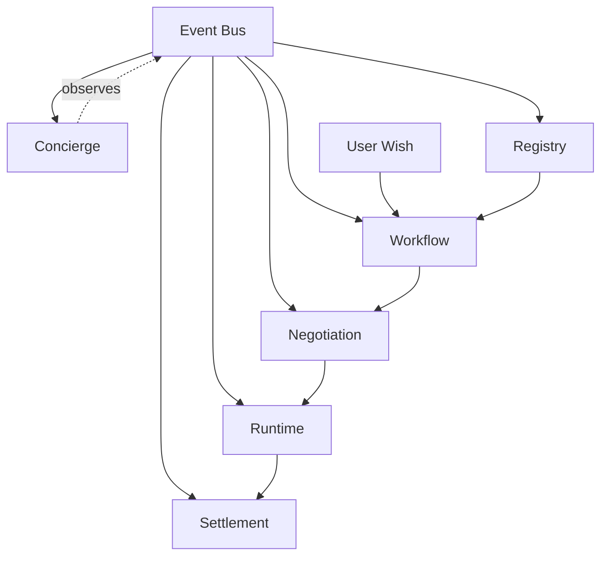
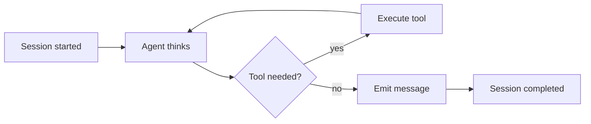
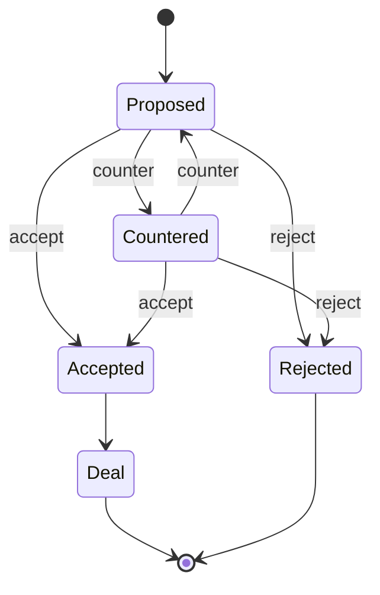
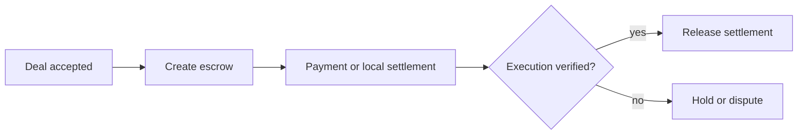
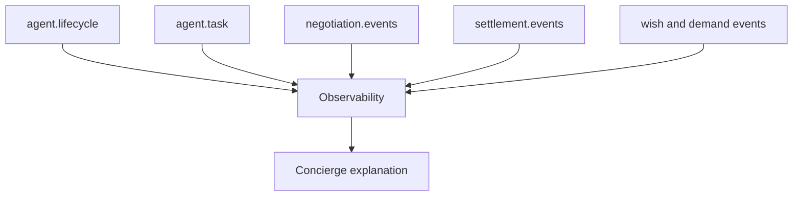

## The Idea

Most agent frameworks treat agents like stateless functions. Call in, response out. No memory, no runtime, no economics.

I wanted something different: **a runtime where agents are first-class actors**. They register, discover each other, negotiate terms, execute work, and settle payments — all inside an event-driven system with observable state.

This is the story of building that system in 48 hours for a hackathon.

<StatStrip stats="48 h::Hackathon build|6::Runtime layers|57::Seeded agents|10::Wish threshold" source="WishLive implementation described in this article" />

<Callout tone="note" title="Scope">
The counts above describe the hackathon implementation and configuration. They are not throughput, reliability, or production-scale benchmarks.
</Callout>

---

## Architecture: Six Layers, One Event Bus

The system is structured as six layers, each independently designed but communication-coupled through an event bus:



Every layer publishes to typed event streams. The event log is the source of truth — no hidden state.

---

## Layer 1: Registry — The Agent Internet

The registry is the DNS + service discovery for agents. Each agent registers with a typed card:

```typescript
interface AgentCard {
	agent_id: string;
	type: 'musician' | 'venue' | 'manager' | 'audience' | 'business';
	name: string;
	skills: string[];
	reputation: number;
	// ...
}
```

Agents send heartbeats every 60 seconds. If they miss, the registry marks them OFFLINE. The `discover()` method implements an A2A discovery protocol — one agent asks a manager agent to find matching candidates by skill, genre, city, or capacity.

The system seeds 57 agents across 6 types on startup. The `onlineCount()` method tracks availability by type in real time.

**Key runtime behavior**: `ensureSeeded()` auto-seeds on first access, so every service that depends on the registry gets a populated agent network without explicit initialization order.

---

## Layer 2: Wish → Workflow Pipeline

Users submit wishes: "I want to see Artist X in City Y on Date Z." The WishWorkflowService:

1. Aggregates wishes by cohort key (genre + city)
2. Runs an agent to record the wish processing
3. When a cohort reaches threshold (10 wishes), triggers demand creation
4. The matching engine finds candidate musicians and venues from the registry
5. Publishes demand events that drive the rest of the system

The threshold is a deliberate design choice — it prevents premature negotiation on insufficient demand.

---

## Layer 3: Runtime — The Execution Engine

This is the core. `AgentRuntimeService.run()` creates a session, then executes in a loop:

```
session started → agent thinks → tool execution → message → session completed
```



The runtime supports **dual-mode execution**:

- **Real mode**: Uses the Vercel AI SDK with `generateText()`, passing runtime tools for discovery, pricing, proposals. The agent decides which tools to call based on the user message.
- **Simulated mode**: Deterministic fallback when no AI provider is configured. Executes the same tool plan but returns structured mock responses.

The graceful degradation is intentional — **simulated mode means I can demo the entire system without an API key**. The switch happens transparently at the session level:

```typescript
if (mode === 'real') {
	try {
		result = await generateWithAISDK(agent, input, session);
	} catch (error) {
		mode = 'simulated'; // graceful fallback
		result = await executePlannedTools(agent, input, session, mode);
	}
} else {
	result = await executePlannedTools(agent, input, session, mode);
}
```

Every step publishes to the `agent.runtime` event stream — thoughts, tool calls, messages, session lifecycle. Langfuse telemetry is wired in for production observability.

---

## Layer 4: Negotiation — Stateful Agent Coordination

The negotiation service models multi-agent coordination as explicit, stateful protocols:

```
create → propose → counter → accept → deal
                    ↓
                 reject
```

Each negotiation has a workflowId, conversationId, and tracks all proposals. The `runAutonomousNegotiation()` method runs the full pipeline automatically:



1. Matches top musician and venue candidates from demand
2. Musician sends initial proposal with terms (venue fee, split percentage)
3. Venue counters with adjusted terms
4. Musician accepts
5. A Deal is created, ready for settlement

The protocol is general enough for human-in-the-loop override — each step has API endpoints for manual accept/reject/counter.

---

## Layer 5: Settlement — Economics On-Chain and Off

Settlement is where execution becomes real. The system supports **dual settlement modes**:

**On-chain (production)**:

- Solidity smart contracts: Escrow (lock/release funds), TicketNFT (mint event tickets), AgentProfile (agent identity)
- Hardhat deployment to local or testnet
- Funds held in escrow until deal confirmed

**Local (development)**:

- Deterministic hash-based transaction IDs
- `localTxHash()` generates consistent 0x-prefixed hashes
- Full simulation of the settlement flow without a blockchain



The critical design choice: **human confirmation gates**. Every settlement action requires explicit confirmation:

```typescript
async createEscrow(input, options: { confirmed: boolean }) {
  if (!options.confirmed) {
    throw new SettlementError(409, "Human confirmation required");
  }
  // ...
}
```

This prevents autonomous agents from moving real money without oversight.

---

## Layer 6: Concierge — The Observability Layer

The concierge is an LLM-powered interface over the entire runtime. It reads event streams from all layers and answers:

- "What is happening right now?"
- "Why is the negotiation stuck?"
- "What happens next in this workflow?"

It supports both streaming and non-streaming responses, with Langfuse tracking on every interaction. When no AI provider is configured, it falls back to a rule-based simulator that summarizes system state from event data.

---

## The Event Bus: Where Everything Connects

All subsystems communicate through typed event streams. The bus has two implementations:

- **MemoryEventBus**: In-memory array, perfect for development and testing
- **RedisEventBus**: Redis Streams with XADD/XREVRANGE, for production persistence

Event types include:

- `agent.lifecycle` — registration, heartbeat, offline transitions
- `agent.runtime` — session lifecycle, thoughts, tool calls
- `agent.task` — A2A message passing between agents
- `negotiation.events` — proposals, counters, accepts, rejections
- `settlement.events` — escrow creation, fund release, ticket minting
- `wish.events` / `demand.events` / `matching.events` — workflow pipeline



```typescript
interface EventEnvelope {
	id: string;
	type: string;
	source: string;
	timestamp: number;
	data: Record<string, unknown>;
	metadata: {
		traceId: string;
		spanId: string;
	};
}
```

Every event carries trace context, enabling end-to-end flow reconstruction.

---

## What I Learned

**Graceful degradation is not optional.** The dual-mode runtime (AI + simulated) meant I could develop and demo the entire system without API keys, then flip to real AI when deploying. This pattern should be standard in every agent framework.

**Event-driven architecture makes multi-agent systems debuggable.** Because every agent action is published to typed event streams, I can reconstruct exactly what happened — even across negotiation rounds, session restarts, and settlement failures.

**Human gates are critical for economic execution.** Without explicit confirmation before escrow creation and fund release, autonomous agents become a financial liability. The `confirmed` flag on every settlement method is the simplest correct design.

**57 seed agents = instant ecosystem.** Seeding the registry with diverse agent cards means every demo starts with a populated marketplace. The auto-seeding pattern (first access triggers population) eliminated initialization order bugs entirely.

---

## The Stack

- **Runtime**: TypeScript, Vercel AI SDK, Zod validation
- **Events**: Redis Streams (prod), in-memory (dev)
- **Contracts**: Solidity, Hardhat, viem
- **Frontend**: Next.js 14, Tailwind CSS
- **Observability**: Langfuse
- **Infrastructure**: Docker Compose, pnpm workspace

---

## Final Thought

WishLive started as a hackathon project. But the architecture — a layered runtime with event-driven communication, dual-mode execution, and on-chain settlement — maps to real production concerns. Agents aren't functions you call. They're actors in a system with state, economics, and coordination.

The code is at [github.com/lora-sys/Hackthon](https://github.com/lora-sys/Hackthon).
