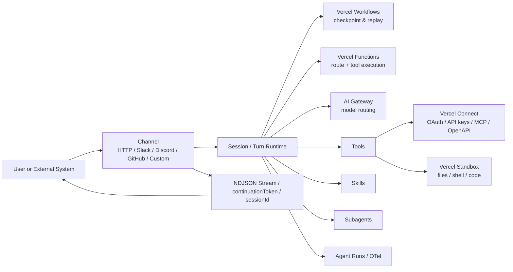
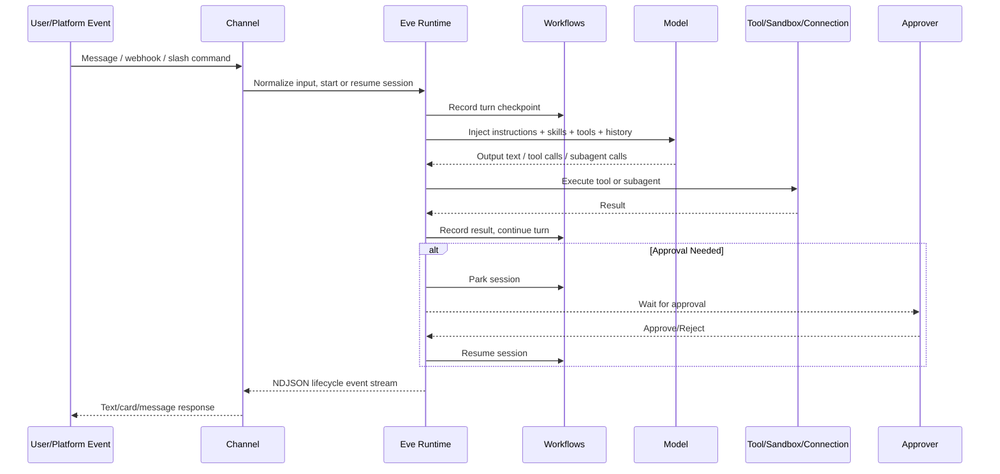

## Executive Summary

Vercel Eve is an open-source Agent framework launched by Vercel in June 2026, and as of 2026-07-03 it remains in Beta/Preview. Its core proposition is not "another agent loop SDK," but modeling an Agent directly as a directory in the filesystem: `instructions.md` handles long-term system prompts, `agent.ts` handles runtime configuration and model selection, and directories like `tools/`, `skills/`, `channels/`, `connections/`, `subagents/`, `schedules/` each carry capabilities, channels, external integrations, sub-agents, and scheduled tasks; the framework compiles these files through auto-discovery into an Agent application running on Vercel Functions with production-grade features: durable execution, event streams, sandbox execution, observability, approvals, and human-in-the-loop collaboration.

From a design perspective, Eve's differentiation comes down to four advantages. First, it's a strongly opinionated filesystem-first programming model that reduces the structural complexity of multi-agent, multi-channel, multi-tool systems. Second, it builds durable execution directly on Vercel Workflows, allowing sessions/turns to recover across cold starts, redeployments, and long pauses. Third, it treats sandboxes as first-class citizens, isolating untrusted code execution by default in a separate security context. Fourth, it's deeply coupled with AI Gateway, Connect, Observability, and OIDC, making model access, credential proxying, tracing, and access control smoother on the Vercel platform.

If your team runs primarily on Vercel, wants to treat Agents as deployable backend systems rather than "model call scripts," and needs Slack/Web/GitHub/scheduled tasks/approvals/long-running/observable production capabilities, Eve will likely ship faster than generic frameworks. Conversely, if you need cross-cloud/self-hosted infrastructure portability, or your team prefers graph-based orchestration (LangGraph), OpenAI-native tools and containers (OpenAI Agents SDK), or framework-agnostic TypeScript AI application frameworks (Mastra), you should evaluate platform binding, runtime assumptions, and migration costs more carefully. This assessment comes from official documentation descriptions of runtime structure, persistence, sandboxes, channels, deployment, and platform service dependencies, as well as comparative analysis with other official framework documentation.

Regarding maturity, Eve's strengths are Vercel-backed ownership, comprehensive documentation, rich templates, and a growing GitHub community. As of this writing, official documentation explicitly labels it Beta, the GitHub repository has approximately 3.2k stars and 252 forks, and official/related templates already cover typical scenarios including Web Chat, Slack content assistants, personal agents, PR triage, and browser agents. This indicates a fairly clear "productized framework" outline, but it should still be treated as a rapidly evolving early-stage framework. Production adoption should be accompanied by approval strategies, authentication, evaluations, cost guardrails, and rollback plans.

## Design Philosophy and Overall Architecture

Eve's basic abstraction is: "an agent is a directory." Both the official documentation and repository emphasize that Eve doesn't use one giant configuration object to declare a system; instead, each concern of an agent is placed in an explicit file location, and the framework convention-discovers these files, compiling them into applications that can run locally, be exposed via HTTP, connect to Slack and other channels, and persist across multiple durable turns.

This design makes an Eve project analogous to "Next.js for Web, Eve for Agents." The official release announcement explicitly uses the Next.js analogy, suggesting the Agent domain has reached the point where repetitive infrastructure can be abstracted into a framework: you no longer stitch together durable loops, auditing, streaming, approvals, sandboxes, and channel integrations yourself — you mainly define "who the agent is, what it knows, and how it interacts with the world."

Platform-wise, Eve on Vercel isn't a single-point feature but a composition of several platform capabilities. Vercel documentation explicitly lists: Vercel Functions for agent routing and tool execution, Vercel Workflows for session persistence and recovery, Vercel Sandbox for isolated execution, AI Gateway for model routing and provider fallback, Vercel Connect for external credentials and connections like OAuth/API keys, and Observability / Agent Runs for runtime telemetry and token statistics.

The table below summarizes Eve's core components and responsibilities:

| Component    | Typical Path / Service                      | Primary Responsibility                                         | Design Implication                                                                               |
| ------------ | ------------------------------------------- | -------------------------------------------------------------- | ------------------------------------------------------------------------------------------------ |
| Agent Config | `agent/agent.ts`                            | Model selection, limits, experimental workflow config          | Runtime strategy centralized, but identity comes from file paths, not an explicit name/id field. |
| Instructions | `agent/instructions.md` / `instructions.ts` | Persistent system prompt                                       | Decouples "role/rules" from tool code.                                                           |
| Tools        | `agent/tools/*.ts`                          | Executable actions with schemas                                | Filename is the tool name; tool results participate in checkpoint/replay.                        |
| Skills       | `agent/skills/*`                            | On-demand procedural knowledge and workflows                   | Avoids stuffing long instructions into every prompt.                                             |
| Channels     | `agent/channels/*`                          | HTTP / Slack / Discord / custom webhook/WS entry               | Same agent reusable across multiple channels.                                                    |
| Connections  | `agent/connections/*`                       | MCP / OpenAPI / OAuth / API key integration                    | Moves URL, auth, and provider details out of prompts.                                            |
| Subagents    | `agent/subagents/*`                         | Focused delegation, concurrent fan-out, specialized identities | Supports fresh state and isolated tool surfaces.                                                 |
| Schedules    | `agent/schedules/*`                         | Cron-driven tasks                                              | Compiled into Cron Jobs on Vercel.                                                               |
| Sandbox      | `agent/sandbox/*` / Vercel Sandbox          | Filesystem, bash, isolated execution environment               | Allows agent code execution/commands in an independent security context.                         |
| Runtime      | Workflows + Functions                       | Session/turn orchestration, streaming, resume                  | Eve's production value concentrates here.                                                        |

The following architecture diagram places these layers together for easier understanding of Eve's system boundaries. The connections are synthesized from official "runtime shape," "channels," "durability," and "Agent Runs" descriptions:



Overall, Eve is an Agent framework that leans toward a backend systems framework rather than a simple prompt/tool SDK. It treats Agents as long-running, recoverable, auditable, and authorized service objects. This is the fundamental distinction from many "simplified agent loop" libraries.

## Programming Model and API

Eve's public TypeScript API is unified: you primarily define agent capabilities through a set of `define*` helper functions, while identity comes from file paths, not a `name` field written in code. The official TypeScript API documentation explicitly states that tool `agent/tools/get_weather.ts` resolves to `get_weather`, and connection `agent/connections/linear.ts` resolves to `linear`. This means the file path itself is part of the API.

The most commonly used API surfaces include: `defineAgent`, `defineTool`, `defineSkill`, `defineInstructions`, `defineChannel`, `eveChannel`, `defineMcpClientConnection`, `defineOpenAPIConnection`, `defineSchedule`, `defineHook`, `defineSandbox`, `defineEval`, and the frontend binding `useEveAgent`. Official documentation also lists several non-`define*` helpers, such as `always`/`once`/`never` approval strategies, `localDev`/`vercelOidc`/`placeholderAuth` channel auth strategies, and default tool wrapping and disabling capabilities.

One frequently overlooked but architecturally critical point: Eve ships with a "default harness / default tool surface." From the official API listing, the framework's built-in wrappable or disableable default tools include `bash`, `readFile`, `writeFile`, `glob`, `grep`, `webFetch`, `webSearch`, `todo`, and `loadSkill`. This means Eve is not an "empty orchestrator" entering the runtime; it brings a strong default capability surface. Production setups must actively audit whether all these capabilities should be exposed to the model.

Here is a minimal, runnable Eve Agent. It corresponds to the official quickstart minimum structure: `instructions.md` + `agent.ts` + one typed tool.

```ts
// agent/agent.ts
import { defineAgent } from 'eve';

export default defineAgent({
	model: 'anthropic/claude-sonnet-5'
});
```

```md
<!-- agent/instructions.md -->

You are a concise weather demo assistant.
If the user asks about weather, clearly state that the data here is mock data.
```

```ts
// agent/tools/get_weather.ts
import { defineTool } from 'eve/tools';
import { z } from 'zod';

export default defineTool({
	description: 'Returns mock weather data for a city.',
	inputSchema: z.object({
		city: z.string().min(1)
	}),
	async execute({ city }) {
		return {
			city,
			condition: 'Sunny',
			temperatureC: 24
		};
	}
});
```

These tools share key characteristics: inputs have schemas, return values must be JSON-serializable, and execution happens in the app runtime. The official tool documentation states that tools can import shared code from `lib/`, read `process.env`, and participate in Eve's durable pause/resume model; however, return values cannot be Dates, Maps, Sets, circular objects, or other unhandled structures.

Eve also provides a highly practical `toModelOutput` hook for trimming a tool's full output into a summary more suitable for the model, while keeping the full structure available for channels/UI/hooks. This design suits scenarios where "the UI needs rich data but the model only needs a summary," such as Slack card rendering, chart data, or large database result sets.

A simplified version looks like this:

```ts
// agent/tools/report_score.ts
import { defineTool } from 'eve/tools';
import { z } from 'zod';

export default defineTool({
	description: 'Generate a site score report.',
	inputSchema: z.object({
		domain: z.string()
	}),
	async execute({ domain }) {
		return {
			domain,
			score: 87,
			rawChecks: [
				{ name: 'seo', score: 90 },
				{ name: 'perf', score: 81 }
			]
		};
	},
	toModelOutput(output) {
		return {
			type: 'text',
			value: `Site ${output.domain} has a composite score of ${output.score}.`
		};
	}
});
```

Approvals are also a first-class concept in Eve's programming model. The official tool documentation provides approval strategies like `always()`, and release articles demonstrate conditional approval based on input criteria. The semantics are: the tool call point durably pauses the session, waits for human approval, then resumes from exactly where it left off. This is significantly stronger than "hanging a pending state in your own application code."

```ts
// agent/tools/refund_charge.ts
import { defineTool } from 'eve/tools';
import { always } from 'eve/tools/approval';
import { z } from 'zod';

export default defineTool({
	description: 'Process a refund.',
	inputSchema: z.object({
		chargeId: z.string(),
		amount: z.number().positive()
	}),
	approval: always(),
	async execute({ chargeId, amount }) {
		return { chargeId, refunded: amount };
	}
});
```

For frontend integration, Eve doesn't require you to separately maintain an agent service and a web service. The official frontend guides and templates show you can mount agents directly into web projects via `eve/next`, `eve/sveltekit` plugins, letting `useEveAgent` initiate sessions and streaming interactions under the same-origin `/eve/v1/*`; the Browser Agent Template also demonstrates `withEve()` mounting the agent within the same Next.js service.

## Lifecycle, Event Streams, Concurrency, and State

Eve's runtime core concepts are sessions and turns. The official Concepts documentation defines these clearly: a session is a persistent conversation/task launched by a channel or HTTP request; each user message or external event creates a turn; within a turn, the agent can call tools, load skills, read/write sandbox files, delegate to sub-agents, and stream lifecycle events back to the client.

This is Eve's fundamental difference from traditional "request/response" chat interfaces. Both the official introduction article and documentation emphasize that an Eve session can stream-work, maintain durable state across multiple turns, pause on approvals/human replies, and resume in the future. The underlying mechanism relies on Vercel Workflows' event log plus deterministic replay: progress is persisted as an event log, and upon recovery, previously recorded steps are replayed to rebuild state. This means it can continue across cold starts, deployment switches, long waits for messages, or tool results.

Eve exposes two important identifiers externally: `sessionId` and `continuationToken`. The official README explains that `sessionId` is used for stream subscription and run inspection, while `continuationToken` is the recovery handle for sending the next message in the same conversation on that surface. This separation design helps distinguish "user-facing continuous sessions" from "platform-internal observable/recoverable objects."

The following event stream diagram synthesizes official session/streaming, subagent, approval, and channel documentation to show Eve's request path from entry to completion, or mid-way pause and recovery:



For concurrency, Eve's key capability comes from subagents. The official Subagents documentation states: the built-in agent tool delegates tasks to "a copy of the current agent"; if the model issues multiple agent calls in one response, Eve executes that batch concurrently and lets the parent agent continue after all return. This makes Eve ideal for "fixed small-batch task fan-out," such as querying multiple data sources in parallel, organizing multiple documents in parallel, or validating multiple hypotheses in parallel.

However, Eve's concurrency is not an "unlimited DAG scheduler." The official documentation explicitly states a default subagent depth limit of 3 child sessions, adjustable via `limits.maxSubagentDepth`; beyond this limit, the framework stops exposing further subagent tools to the model, and even if a call forcibly reaches the execution layer, it will be rejected. This indicates Eve's concurrency/recursion model is a controlled tree-like session expansion, not an arbitrary graph runtime.

For state management, Eve requires understanding in three layers. The first is durable session state: guaranteed by Workflows, persisting across turns and pause/resume. The second is sandbox filesystem state: built-in agent subagents share the sandbox with the parent agent, and file writes become immediately visible to the parent; declared subagents default to their own sandbox boundaries. The third is authored state / `defineState` context: the official documentation explicitly states that `defineState` is not shared between parent and child agents, and subagents always start from fresh durable state.

This means production setups must pay special attention to two boundary types:

First, shared sandboxes introduce concurrent write collision risk. The official documentation explicitly recommends providing non-overlapping write scopes for parallel child tasks. If you let multiple built-in agent subagents write to the same file or directory simultaneously, non-deterministic collisions are easy to encounter.

Second, declared subagents don't inherit root authored slots. Except for the built-in copy mode, a declared subagent won't automatically inherit the parent's instructions, tools, connections, skills, or sandbox; missing items fall back to framework defaults, not the root version. In other words, Eve's declared subagents are more like "local independent agent packages." This brings stronger isolation but requires you to explicitly replicate or extract shared capabilities.

Regarding replay and side effects, the official tool documentation emphasizes: completed steps do not re-run; Eve replays recorded results; but steps interrupted during execution will re-execute. Therefore any non-idempotent side effects — sending emails, charging fees, processing refunds, writing to external systems — must be designed idempotently or placed under approval/transactional protection. This is one of the most important traps in Eve production design.

## Deployment, Scaling, Security, Observability, and Cost on Vercel

On the Vercel platform, Eve's deployment model is straightforward: the framework compiles agents into applications running on Vercel Functions, with Functions handling session requests, stream attachment, channel webhooks, and tool execution; while session/turn/subagent progress is persisted by Vercel Workflows. Official templates and frontend integration documentation further indicate that Eve can be combined with Next.js/SvelteKit web apps into a single project and single deployment, avoiding separate maintenance of agent services.

From a scaling perspective, Eve borrows Vercel platform capabilities rather than implementing its own cluster scheduler. The Concepts document states that agents run on Functions on Vercel, and because turns may run long and require incremental streaming output, Eve benefits from Fluid Compute enabled by default; meanwhile, what truly determines "sustained long execution" is Workflows' checkpoint/replay, not a long-lived process.

This also means Eve's scaling characteristics resemble a "serverless + durable orchestration" combination rather than traditional resident workers: short workloads handled by Functions throughput, long processes persistently saved and restored by Workflows. For production teams, this model typically brings stronger recovery and lower operational burden, but it also means you need to put performance analysis on dimensions like turn count, tool count, stream chunk count, and sandbox usage, rather than just looking at single-machine QPS.

### Security and Permissions

Eve has several default security premises. First, model access goes through AI Gateway, which on Vercel can use OIDC instead of directly managing provider API keys; the AI Gateway documentation also states that every request requires authentication, supporting API keys or OIDC, and Bring Your Own Key.

Second, the sandbox as an isolation boundary is crucial. Vercel Sandbox documentation defines it as a compute primitive for safely running untrusted or user-generated code; Eve's release article further explains that agent-generated code doesn't enter the application runtime but executes in a sandbox within an independent security context; on Vercel, it uses ephemeral microVMs.

Third, the default HTTP channel is fail-closed. The official frontend guide writes clearly: if you don't customize `agent/channels/eve.ts`, the default registers `eveChannel({ auth: [vercelOidc(), localDev()] })` — meaning it prioritizes accepting Vercel invocations and local development traffic, returning 401 for everything else. Only public demos and similar scenarios should explicitly use `none()` to relax authentication.

Additionally, Vercel Connect provides a solid credential governance foundation for Eve's external integrations. The official Connect documentation states that Connect supports Custom OAuth/OIDC + PKCE and API key storage; its "Concepts" documentation also describes triggers: third-party inbound webhooks are verified by Vercel Connect and forwarded to your project. This is particularly valuable for Slack, GitHub, SaaS webhooks, and multi-tenant integrations.

But Eve's official documentation also gives one very important warning: without additional stricter configuration, Eve may run under quite permissive default conditions, including tools executing directly without explicit approval requirements and sandbox network egress not being deny-all. Eve explicitly requires deployers to configure their own guardrails for approval strategies, tool limits, connection scopes, route/session authorization, sandbox controls, and telemetry exports.

### Observability

Observability is where Eve looks most like a "productized backend framework." The official Observability documentation states that every Eve project gets Agent Runs by default: without a separate `instrumentation.ts`, you can see in the Vercel Dashboard runs broken down by trigger type, token input/output/cache volumes, turn counts, durations, and per-turn details including tool calls, reasoning, and timing.

If you need integration with your company's existing tracing体系, Eve also supports registering OpenTelemetry exporters in `agent/instrumentation.ts`. The official example demonstrates a Braintrust exporter and states that any OTel-compatible backend can be connected, such as Honeycomb, Datadog, Jaeger, etc. Since the instrumentation file runs automatically before agent startup and any agent code, it's also suitable for unified telemetry initialization.

Note that the official documentation simultaneously reminds: since Agent Runs captures session, reasoning, tool input/output, and other runtime information, if processing personal, sensitive, or regulated data, deployers may need to explain these collection behaviors in privacy materials and legal disclosures. In other words, the stronger the observability, the greater the compliance responsibility.

### Cost Considerations

Eve is not a single billing item but a composite cost surface. The official Pricing document lists billable resources including: Vercel Functions, Vercel Workflows, Vercel Sandbox, AI Gateway, and underlying model providers. Common cost drivers include session/turn counts, prompt and output tokens, tool calls, stream writes to persistence, and sandbox execution/snapshot/network traffic.

The table below compresses Eve's main cost surfaces into a practical perspective:

| Cost Surface             | When It Increases                                     | Typical Signal                                  | Control Measures                                                                                                 |
| ------------------------ | ----------------------------------------------------- | ----------------------------------------------- | ---------------------------------------------------------------------------------------------------------------- |
| Model tokens             | Long history, large tool returns, long reasoning      | Rising input/output/cached tokens in Agent Runs | Shorten history, trim tool output, load long flows into skills on-demand, use smaller models for low-risk tasks. |
| Workflow events/storage  | Multi-turn, multi-stream chunks, multi-tool calls     | High turn count, many stream chunks             | Merge meaningless intermediate output, split long tasks, reduce meaningless streaming.                           |
| Functions duration       | Slow external APIs, heavy tool logic                  | Elevated single-turn duration                   | Offload heavy CPU/untrusted tasks to sandbox; optimize external API calls.                                       |
| Sandbox cost             | Code writing/command running/snapshots/network access | Frequent sandbox usage                          | Enable sandbox only for necessary tasks, limit network policies and lifecycles.                                  |
| Third-party service cost | SaaS APIs, MCP, databases                             | Rising external platform bills                  | Tool-level caching, idempotent retries, connection scope minimization.                                           |

A very practical suggestion: don't first calculate "roughly how much per month," but instead run a representative task profile. The official Pricing document recommends recording: turn count per task, model/tool call count per turn, token input/output/cache volume, stream data volume, and whether sandbox, snapshots, networking, and long-term persistence were used, then mapping to platform product billing items. This is a more reliable approach than "guessing by feel."

## Integration Methods, Patterns, and Minimal Runnable Examples

Eve's integration methods can be summarized in three threads: channel access, external capability access, and application-layer persistence access. The official documentation shows that channels are entry adaptation layers, connections are external capability directories, and tools are arbitrary business logic executed in the app runtime; in other words, Eve's attitude toward "integration" is not giving you one super unified bus, but distributing integration to the appropriate layers.

### Webhooks and Multi-Channel

The official Channels document defines a channel as a platform-to-agent edge adapter: it's responsible for normalizing platform input into user messages, holding the continuationToken, and deciding how responses are sent back. Besides the default HTTP channel, Eve has built-in platform channels for Slack, Discord, Teams, Telegram, Twilio, GitHub, and Linear, and allows custom webhook/WebSocket adaptation layers via `defineChannel`.

If you just want to expose the Agent as an HTTP API, you can use the officially provided `/eve/v1/session` and `/eve/v1/session/:id/stream` routes locally. The official documentation gives the simplest interaction method as follows:

```bash
curl -X POST http://127.0.0.1:3000/eve/v1/session \
  -H 'content-type: application/json' \
  -d '{"message":"Please summarize this repository"}'

# After getting x-eve-session-id from the response header:
curl http://127.0.0.1:3000/eve/v1/session/<sessionId>/stream
```

If you want to deploy the Web frontend and Agent as one project, the official frontend guides and templates demonstrate the simplest usage of `useEveAgent`. The following approach comes from the official SvelteKit guide; the React/Vue approach is the same: components only need to call `useEveAgent()`, without maintaining an independent Agent Host.

```ts
// Pseudocode, concept consistent with official Svelte example
import { useEveAgent } from 'eve/svelte';

const agent = useEveAgent();

await agent.send({
	message: 'Help me summarize the alert trends for the last 7 days'
});
```

### Database and Application-Layer Persistence

Eve is not a database framework, but it integrates with databases easily. The official tool documentation explicitly states that tool execution happens in the app runtime, so it can import from `lib/`, read `process.env`, and connect to any database or backend. The official chat template documentation further demonstrates common practice: the browser interacts with the agent via same-origin `/eve/v1/*`, and streaming events are persisted to Postgres upon arrival, maintaining a session cursor for interruption recovery; the template stack explicitly uses Neon, Drizzle, Better Auth, and Upstash Redis.

This also explains Eve's best practice on databases: put strong transactions, record persistence, and session metadata storage at the application layer or tool layer, rather than expecting Eve's core to provide a universal ORM/memory store abstraction. This conclusion is a reasonable inference based on the design orientation of official templates and core documentation.

Also note a Vercel platform-level change: the official Postgres documentation states that Vercel Postgres is no longer offered, existing instances have been migrated to Neon, and new projects are advised to connect external Postgres through the Marketplace. This means when doing production databases with Eve on Vercel, you'll likely use Neon or external PG rather than a "platform-built-in database."

### Third-Party APIs, MCP, and OpenAPI

Eve's preferred integration point for third-party capabilities is `connections/`. The release article states that a connection file can point to an MCP server or any OpenAPI-compatible API; Eve discovers remote tools, proxies authentication, and never exposes connection URLs and credentials to the model. The official TypeScript API also explicitly includes `defineMcpClientConnection` and `defineOpenAPIConnection` as two definition functions.

A minimal MCP connection example is almost a linear version of the official blog post:

```ts
// agent/connections/linear.ts
import { defineMcpClientConnection } from 'eve/connections';

export default defineMcpClientConnection({
	url: 'https://mcp.linear.app/sse',
	description: 'Linear workspace: issues, projects, cycles, comments.',
	auth: {
		getToken: async () => ({ token: process.env.LINEAR_API_TOKEN! })
	}
});
```

If you need user-level authorization without handling OAuth details yourself, leveraging Vercel Connect is more recommended. The official Connect documentation states it supports OAuth/OIDC with PKCE, API key storage, project links, and verified webhook triggers; while Eve documentation suggests pairing tools with Connect in delegated user/team credential scenarios.

### Scheduled Tasks and Background Mode

Eve's scheduled task capability comes from `agent/schedules/`. Each schedule is a single file with a cron, which can be pure markdown task mode or a `run({ receive, waitUntil, appAuth })` handler mode. The official documentation explicitly states: on Vercel, each schedule becomes a Vercel Cron Job, and cron expressions are interpreted in UTC.

Here is a minimal runnable handler schedule: it delivers a message to a Slack channel every minute.

```ts
// agent/schedules/heartbeat.ts
import { defineSchedule } from 'eve/schedules';
import slack from '../channels/slack.js';

export default defineSchedule({
	cron: '* * * * *',
	async run({ receive, waitUntil, appAuth }) {
		waitUntil(
			receive(slack, {
				message: 'Check if there are new critical alerts; if not, send nothing.',
				target: { channelId: 'C0123ABC' },
				auth: appAuth
			})
		);
	}
});
```

A very key limitation: markdown task-mode schedules cannot park to wait for approval or OAuth login; only the handler form can continue with durable runtime semantics after handoff. If planned tasks might encounter human approval or user authorization in production, this must be designed upfront.

## Common Usage Patterns

Combining official templates and documentation, I believe Eve is best suited for the following patterns:

| Pattern                                        | Why It Fits Eve                                                                 | Representative Resources                         |
| ---------------------------------------------- | ------------------------------------------------------------------------------- | ------------------------------------------------ |
| Web Chat + Durable Backend                     | Same-origin `/eve/v1/*`, co-deployed frontend/backend, recoverable sessions     | Eve Chat Template, Browser Agent Template        |
| Slack/Team Assistant                           | Channels are first-class concepts, support cards and approvals                  | Slack starter, content assistant                 |
| Approval-Driven Operations/Internal Tools      | Tool approvals durably pause/resume                                             | Tools approval docs, release article             |
| Browser/Code/File Workflows                    | Each agent ships with a sandbox, suitable for ad-hoc scripts and file artifacts | Official release article, Browser Agent Template |
| Scheduled Inspection/Daily Reports/Auto Triage | Schedules compile directly into Vercel Cron Jobs                                | Schedules documentation                          |

## Comparison with Alternative Frameworks

As of this writing, there is no official standardized benchmark comparing Eve with other mainstream Agent frameworks. Therefore the following "performance/throughput" assessments are not lab benchmarks but qualitative analyses based on each framework's official documentation describing execution models, persistence semantics, deployment methods, and built-in capabilities. I will explicitly mark these as architectural inferences rather than official benchmarks.

### Overall Comparison

| Dimension                 | Eve                                                                          | LangGraph                                                                      | OpenAI Agents SDK                                                          | Mastra                                                                                                |
| ------------------------- | ---------------------------------------------------------------------------- | ------------------------------------------------------------------------------ | -------------------------------------------------------------------------- | ----------------------------------------------------------------------------------------------------- |
| Design Center             | Filesystem-first, agent is a directory; production capabilities built-in     | Graph/state-machine-first, low-level orchestration runtime                     | SDK-first, agents/runs/handoffs/sessions defined in code                   | TypeScript AI application framework, agents/workflows/memory equally emphasized                       |
| Durable Execution         | Built-in, based on Vercel Workflows                                          | Strong suit,主打 durable execution/persistence                                 | SDK manages turns/tools/sessions; also supports sandbox agents             | Has durable agents, but docs still label Beta                                                         |
| Concurrency & Multi-Agent | Built-in subagents, folder-style specialists, default depth limits           | Most flexible for complex orchestration with graph nodes and state transitions | Strong handoffs/specialists, ideal for OpenAI-native runtimes              | Composable workflows, memory, multi-agent patterns                                                    |
| Channels/Multi-Surface    | Built-in HTTP + multi-platform channels + custom channels                    | Typically requires self-integration of Web/Slack surfaces                      | Primarily SDK/runtime semantics, channel layer needs app-level integration | More app-framework oriented, deploys anywhere, but channels aren't a first-class abstraction like Eve |
| Platform Binding          | Strong, Vercel-native best                                                   | Relatively neutral                                                             | Most friendly to OpenAI ecosystem, but can pair with other providers       | Deploys anywhere, stronger framework neutrality                                                       |
| Developer Experience      | Very efficient for Vercel users; clear directory structure; many conventions | Flexible but lower-level, higher learning curve                                | Direct and natural for SDK users; more code-centric                        | Strong TypeScript full-stack feel; broad feature surface, but system boundaries more dispersed        |

### Design Philosophy and Developer Experience

**Eve vs LangGraph**: LangGraph officially positions itself as a low-level orchestration framework and runtime, focusing on durable execution, streaming, HITL, and persistence; while Eve is more of a "framework-definition product" that brings conventions, file layout, channels, and platform integrations together. If you want precise control over state graphs, nodes, back-edges, and custom scheduling, LangGraph is freer; if you want to quickly deploy a multi-channel, recoverable, sandbox-equipped agent, Eve's path is shorter.

**Eve vs OpenAI Agents SDK**: The official OpenAI documentation clearly distinguishes the Responses API from the Agents SDK, the latter being suitable when applications need the SDK to handle orchestration, tool execution, approvals, state, and sessions. It's a very "SDK/code-first" design, while Eve is "directory/framework-first." If your capabilities heavily depend on OpenAI-native tools, container execution, realtime/voice agents, and the tracing ecosystem, OpenAI Agents SDK's integrated experience will be strong; but if you value Web/Slack/GitHub multi-entry unification, Vercel deployment, and platform governance more, Eve is more convenient.

**Eve vs Mastra**: Mastra officially emphasizes itself as an open-source TypeScript AI framework providing agents, workflows, memory, workspaces, and observability, deployable to various frameworks and standalone servers. In contrast, Eve has a narrower framework boundary and stronger platform binding, but does "condensing production Agent shapes into a directory" more thoroughly. Mastra is attractive for teams wanting to unify agents + workflows + memory + apps; Eve is better suited for treating "durable agent backends" as separate product objects to govern.

### Performance and Runtime Trade-offs

If looking only at single-turn, short-path, light-tool scenarios, Eve's Workflow persistence, stream writes, and Agent Runs collection bring additional control surface costs; in such scenarios, using the Responses API directly, OpenAI Agents SDK, or lightweight LangGraph graphs could theoretically have lower runtime overhead. This is an architectural inference based on official descriptions of Eve's Workflow persistence, stream persistence, and multi-layer billing resources.

But if the task is long-running, interruptible, requiring approvals, needing multi-turn recovery, needing sandboxes or subagent fan-out, Eve's built-in durable model often offsets the complexity these additional overheads bring: you don't need to implement replay, pause/resume, stream reconnection, auditing, and channel glue code yourself. In other words, Eve's advantage isn't "fastest," but "making high-complexity production semantics the default."

### When to Choose Which

| Your Primary Need                                                                            | Recommendation    |
| -------------------------------------------------------------------------------------------- | ----------------- |
| I'm on Vercel, need a shippable durable agent backend with Web/Slack/approvals/observability | Eve               |
| I need fine-grained control over state graphs, branching, and custom orchestration           | LangGraph         |
| I deeply use OpenAI platform-native tools/sandbox/realtime                                   | OpenAI Agents SDK |
| I want a TypeScript full-stack AI framework with agents/workflows/memory unified             | Mastra            |

## Limitations, Pitfalls, Troubleshooting, Ecosystem, and Production Adoption Advice

### Known Limitations and Common Pitfalls

1. **Eve is still Beta/Preview.** This means APIs, behaviors, and documentation may change before GA. If your organization has strict requirements for platform stability, long-cycle support, or compliance auditing, Eve should be treated as "production-capable pilot, not zero-constraint full rollout."

2. **Strong platform binding.** Although official documentation includes self-host / `eve build && eve start` instructions, Eve's smoothest capability composition clearly occurs on the Vercel platform: AI Gateway OIDC, Functions, Workflows, Sandbox, Connect, and Agent Runs are all key components. Running outside Vercel is possible but increases mental model and operational complexity. This judgment comes from official product combinations and Vercel-specific integration documentation.

3. **Large default capability surface.** The official documentation explicitly lists default tools including bash, file read/write, webFetch, webSearch, todo, loadSkill, and the warning that "without additional controls, tool execution may be permissive and sandbox networking may not be deny-all." Therefore Eve cannot rely solely on instructions hoping the model "won't misbehave"; you must close the aperture from four layers simultaneously: auth, approval, tools, connections, and sandbox policy.

4. **Concurrent fan-out easily introduces shared write collisions.** If you run multiple subtasks in parallel with the built-in agent tool, they share the parent agent's sandbox and tool surface, and writing the same path causes non-deterministic overwrites. The official documentation explicitly recommends providing non-overlapping write scopes.

5. **Non-idempotent tools may re-run after interruption.** The official tool documentation has explained this very clearly. In production, charging, notifications, writing to external systems must introduce idempotency keys, state locks, or approvals.

6. **Two typical pitfalls with scheduled tasks:** Vercel Cron interprets expressions in UTC; and markdown task-mode schedules cannot wait for approval/OAuth. Additionally, custom hosting without properly starting the Nitro schedule runner may result in "tasks compiled but not auto-triggered."

7. **Subagent naming conflicts and depth limits.** Subagent tool names share the same runtime tool namespace as regular tools; if `subagents/researcher` and `tools/researcher.ts` have the same name, the build will fail; the default depth limit is also 3 child sessions.

8. **Limited official Chinese resources.** As of this writing, Vercel's official Eve documentation and Knowledge Base are primarily in English; Chinese content mostly comes from community interpretations and reposts with varying quality. Chinese-language teams should treat official English docs + repository docs as the primary source, with Chinese content as supplementary material.

### Troubleshooting Guide

| Problem Symptom                                    | Priority Check                                                                                              | Basis                                                                |
| -------------------------------------------------- | ----------------------------------------------------------------------------------------------------------- | -------------------------------------------------------------------- |
| New files not recognized by Eve                    | Run `eve info`, check discovery diagnostics and `.eve/` artifacts; confirm file path is in the correct slot | Official Project Layout recommends `eve info` for discovery failures |
| Browser frontend gets 401                          | Check `agent/channels/eve.ts` auth; default is `vercelOidc()` + `localDev()`, not public                    | Official frontend guide states default eve channel is fail-closed    |
| Subagent can't access parent tools/skills          | Expected behavior for declared subagents; they don't inherit root authored slots                            | Official Subagents documentation                                     |
| Tool return value causes exceptions                | Check if output is JSON-serializable; avoid Date/Map/Set/NaN/circular objects                               | Official Tools documentation                                         |
| Scheduled tasks don't trigger in local dev         | `eve dev` doesn't auto-trigger on cron; use dev dispatch route or built app                                 | Official Schedules documentation                                     |
| Schedule doesn't execute in self-hosted production | Confirm whether you actually ran `eve start`/Nitro scheduler, not just provided HTTP                        | Official Schedules documentation                                     |
| Sensitive actions still potentially callable       | Subagent isolation is not an approval boundary; use approval, connection approval, route/session auth       | Official Subagents and safeguards documentation                      |

### Ecosystem, Maturity, and Recommended Resources

Eve's ecosystem is rapidly forming. Official and official-related resources currently include at minimum: core repository, Vercel Docs, Vercel Blog/Changelog, Knowledge Base, and multiple open-source templates. The GitHub repository has approximately 3.2k stars and 252 forks as of this writing, with active signals in Issues, PRs, and Discussions.

Recommended resources, read in "official first, then templates, then community" priority order:

| Resource                                  | Purpose                                                                        | Priority  |
| ----------------------------------------- | ------------------------------------------------------------------------------ | --------- |
| Eve Overview Docs                         | Framework overview, platform mapping, minimal example                          | Very High |
| Concepts                                  | Core mental model for sessions/turns, durability, channels, sandbox, subagents | Very High |
| TypeScript API                            | Authoritative entry for define\*, ctx, import paths                            | Very High |
| Project Layout                            | File slots, root/subagent boundaries, debugging entry                          | Very High |
| Tools / Subagents / Schedules Docs        | Production-grade feature details and pitfalls                                  | Very High |
| Observability / Pricing Docs              | Core basis for monitoring and cost control post-launch                         | Very High |
| Official Release Article: Introducing Eve | Most comprehensive design philosophy and end-to-end examples                   | Very High |
| Eve Chat Template                         | Best practice for Web Chat + Postgres persistence                              | Very High |
| Eve Slack Agent / Content Agent Templates | Team assistants, content workflows, Connect/OAuth integration patterns         | High      |
| Browser Agent Template                    | Web Chat + browser agent + single-project deployment paradigm                  | High      |
| Chinese Community Interpretations         | Supplementary understanding, but confirm back to official docs                 | Medium    |

### Production Adoption Recommendations

If you're asking "is Eve production-ready," my conclusion is: yes, but on the premise that you accept it as a Vercel-native, strongly opinionated, still-Beta production Agent framework. For most teams already deeply using Vercel, I recommend evaluating Eve as the first-priority pilot framework, because its integration of durable execution, sandbox, channels, approvals, observability, and deployment is genuinely high.

But "pilot" doesn't mean "directly replace everything." The safest path for production adoption:

| Stage         | Recommended Approach                                                                                                          |
| ------------- | ----------------------------------------------------------------------------------------------------------------------------- |
| Pilot         | Start with a single channel and single business line, e.g., internal Slack assistant, Web Chat retrieval assistant, PR triage |
| Governance    | Define auth, approval, sandbox egress, tool allowlist first; then write model instructions                                    |
| Measurement   | Use Agent Runs as the primary lens for tokens, turns, tools, duration; integrate OTel if needed                               |
| Stabilization | Add evaluations, CI, idempotency, and cost alerts; incorporate schedules and subagents deeply into operational boundaries     |

### Migration Checklist

If your existing system comes from LangGraph, custom agent loops, OpenAI Agents SDK, or other frameworks, here is a pragmatic migration checklist:

| Check Item                             | Migration Action                                                                                                        |
| -------------------------------------- | ----------------------------------------------------------------------------------------------------------------------- |
| Agent identity and directory structure | Map "roles, tools, skills, channels, scheduled tasks, subagents" to file slots under `agent/`                           |
| Tool functions                         | Wrap existing tools with `defineTool`, add zod schemas, confirm output is JSON-serializable                             |
| Permissions and sensitive operations   | Add approval or route/session auth for refunds, email sending, DB writes, production API calls                          |
| Prompts/knowledge                      | Split long instructions into `instructions.md` + `skills/`; avoid context bloat                                         |
| External APIs                          | Migrate to `connections/` + Connect at priority; at minimum strip credentials from prompt/tool text                     |
| Long flows/multi-turn recovery         | Migrate logic previously maintained by custom state machines to session/turn thinking; identify pause/resume boundaries |
| Web/Slack entry points                 | Prefer built-in channels; use `defineChannel` only for custom surfaces                                                  |
| Frontend deployment                    | If already using Next.js/Nuxt/SvelteKit, prioritize single-project mounting over dual services                          |
| Scheduled tasks                        | Clarify UTC cron, whether审批/OAuth may trigger, whether handler mode is needed                                         |
| Idempotency and rollback               | Design idempotency keys and compensation logic for all external side effects, since interrupted steps may re-run        |
| Observability and privacy              | Enable Agent Runs, integrate OTel if needed, and assess sensitive data tracking disclosure obligations                  |

## Final Recommendation

If your tech stack is centered around Vercel, my recommendation is clear: you can adopt Eve, but proceed as a "production framework pilot" rather than a "prototype tool." Prioritize landing in internal assistants, content workflows, retrieval/knowledge assistants, PR triage, and browser/file-type agents; for financial, legal, medical, and external write-operation scenarios, must-frontload approvals, idempotency, auditing, and permissions as design constraints rather than post-launch patches. Comprehensive official documentation, templates, and platform capabilities indicate that Eve's greatest value isn't making Agents "smarter," but making Agents more like genuinely operable backend systems.
